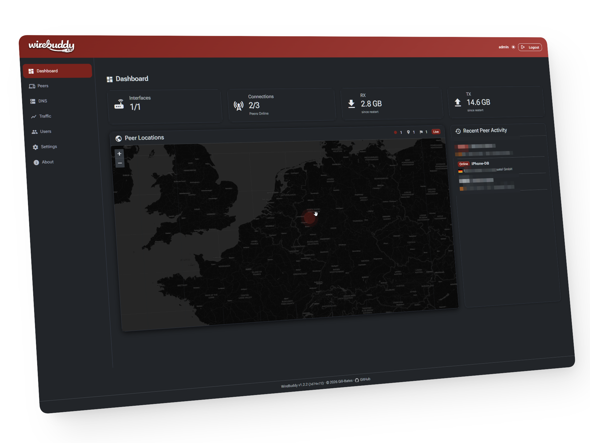
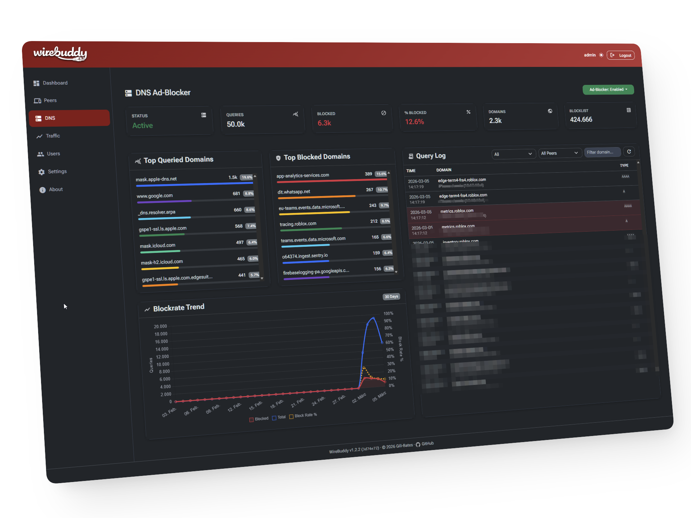
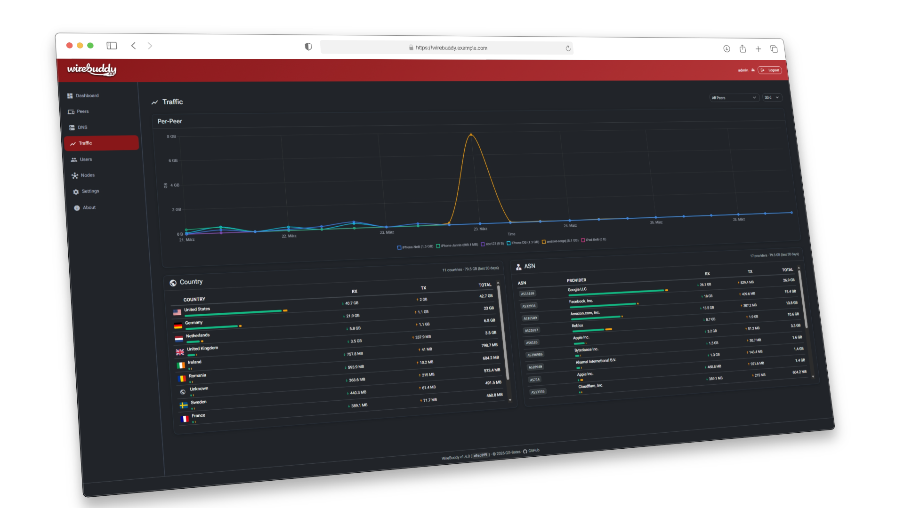

<p align="center">
  
  
</p>

<h2 align="center">Use Wireguard with ease!</h2>

<p align="center">
  <a href="https://hub.docker.com/r/giiibates/wirebuddy"></a>
  <a href="https://hub.docker.com/r/giiibates/wirebuddy"></a>
  <a href="https://hub.docker.com/r/giiibates/wirebuddy"></a>
  <br>
  <a href="LICENSE"></a>
  <a href="#-quick-start"></a>
</p>

<p align="center">
  <a href="#-quick-start">Quick Start</a> •
  <a href="#-features">Features</a> •
  <a href="#%EF%B8%8F-configuration">Configuration</a> •
  <a href="#-api">API</a> •
  <a href="#-security">Security</a> •
  <a href="#-license">License</a>
</p>

---

## 🚀 Quick Start

### Docker (Recommended)

```bash
# Clone the repository
git clone https://github.com/Gill-Bates/wirebuddy.git
cd wirebuddy

# Copy and edit settings
cp .env-example settings.env
# Edit settings.env — set WIREBUDDY_SECRET_KEY!

# Run
docker compose up -d
```

The default compose file expects an external Docker network (`cloudnet`) and
does not expose port 8000. To access the UI directly, add `8000:8000` under
`ports` or place the container behind your reverse proxy.

> **Default credentials:** `admin` / `admin`
> ⚠️ **Change the default password immediately after first login!**

### Screenshots

<p align="center">
  
</p>
<p align="center">
  
</p>
<p align="center">
  
</p>

### Local Development

```bash
python3.13 -m venv .venv && source .venv/bin/activate
pip install -r requirements.txt
python main.py
```

---

## ✨ Features

### 🔒 WireGuard VPN Management

- **Multi-interface support** — create, start, stop, and delete multiple WireGuard interfaces
- **Full peer lifecycle** — add, edit, remove peers with automatic IP allocation
- **Automatic keypair & PSK generation** — including post-quantum preshared keys
- **Routing presets** — Full Tunnel, Isolated (no LAN), or Custom CIDR ranges
- **QR codes & config downloads** — one-tap mobile setup
- **Config persistence** — configs rebuild from database on every container restart
- **Auto-start & graceful shutdown** — interfaces come up on boot and shut down cleanly

### 🌍 DNS & Ad-Blocking (Unbound)

- **Integrated Unbound DNS resolver** — start, stop, restart, reload from the UI
- **Ad-blocking with blocklists** — StevenBlack/hosts, EasyList (hosts format), optional adult list, and custom sources; auto-updated every 24 h
- **Wildcard subdomain blocking** — optionally block all subdomains of blocked domains
- **DNS-over-TLS upstream** — configurable upstream servers
- **Real-time query log** — search, filter, blocked/allowed badges
- **Top domains & trend charts** — DNS analytics at a glance
- **DNSSEC** — root key initialization out of the box

### 📊 Monitoring & Metrics

- **Built-in TSDB** — JSONL time-series database with gzip rotation and configurable retention (default 365 days)
- **30-second metric sampling** — RX/TX bytes, handshake timestamps per peer
- **Traffic charts** — per-peer bandwidth graphs (6 h, 24 h, 3 d, 7 d)
- **Connection status** — live doughnut chart: connected vs. offline peers
- **Dashboard** — stats cards, recent activity sidebar, auto-refresh with backoff

### 🗺️ GeoIP & Location Intelligence

- **MaxMind GeoLite2** — automatic IP geolocation for peer endpoints
- **Interactive map** — Leaflet.js with heatmap layer showing peer locations
- **Country flags & ASN badges** — visual context at a glance
- **Auto-updating** — weekly GeoIP database refresh in the background

### 🔐 Let's Encrypt (ACME)

- **Built-in ACME client** — production & staging Let's Encrypt directories
- **HTTP-01 challenge** — automatic challenge serving
- **Certificate management UI** — request, list, renew, delete certificates
- **Worker-safe** — file-based domain locks prevent concurrent orders

### 👥 User Management

- **Multi-user with roles** — admin and standard user roles
- **Self-service password change** — with current-password verification
- **Login tracking** — last login timestamp and IP recorded
- **Token lifecycle** — create, refresh, revoke auth tokens; automatic cleanup

### 🎨 Web UI

- **Responsive Bootstrap 5** — optimized for desktop and mobile
- **Dark / Light / Auto theme** — system-preference detection, zero-flash
- **Six pages** — Dashboard, Peers, DNS, Settings (tabbed), Users, About
- **Auto-refresh & reconnect** — 30 s polling with exponential backoff; overlay on disconnect
- **Material Icons** — consistent iconography across the UI

---

## ⚙️ Configuration

Environment variables (via `settings.env` or Docker env):

| Variable | Default | Description |
|---|---|---|
| `WIREBUDDY_SECRET_KEY` | *(required)* | Encryption key for secrets & sessions |
| `WIREBUDDY_DATA_DIR` | `/data` | Persistent data directory |
| `LOG_LEVEL` | `INFO` | Logging verbosity |

---

## 📡 API

Full RESTful JSON API with automatic OpenAPI documentation:

| Endpoint | Description |
|---|---|
| `GET /api/docs` | Swagger UI |
| `GET /api/redoc` | ReDoc |
| `/api/wireguard/*` | Interfaces & peers CRUD |
| `/api/dns/*` | Unbound control & query logs |
| `/api/acme/*` | Let's Encrypt certificates |
| `/api/users/*` | User management |

---

## 🛡️ Security

| Layer | Implementation |
|---|---|
| **Passwords** | PBKDF2-SHA256, 600 000 iterations, random salt |
| **Secrets at rest** | Fernet encryption (PBKDF2 + per-row salt + app pepper) |
| **Auth tokens** | SHA-256 hashed before storage, expiry enforced |
| **CSRF** | Double-submit cookie + Origin header validation |
| **Brute-force** | Rate limiting + progressive IP lockout with backoff |
| **Proxy trust** | `X-Forwarded-For` only accepted from configured proxies |
| **Input validation** | Strict regex for interface names; Pydantic for all payloads |
| **Container** | `no-new-privileges`, minimal capabilities (`NET_ADMIN`) |

---

## 📝 License

This project is licensed under the **GNU Affero General Public License v3.0** — see [LICENSE](LICENSE) for details.

---

<p align="center">
  Made with ☕ by <a href="https://github.com/Gill-Bates">Gill-Bates</a> | © 2026
</p>
