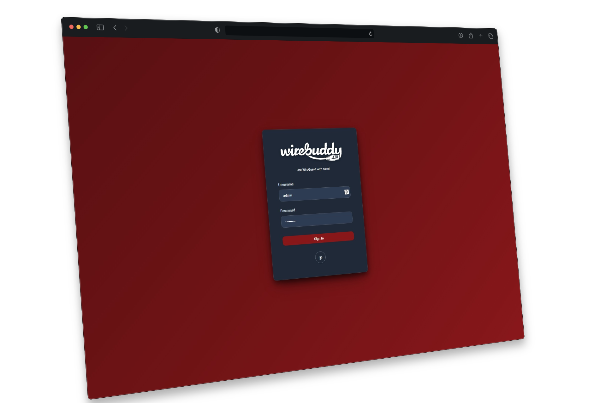
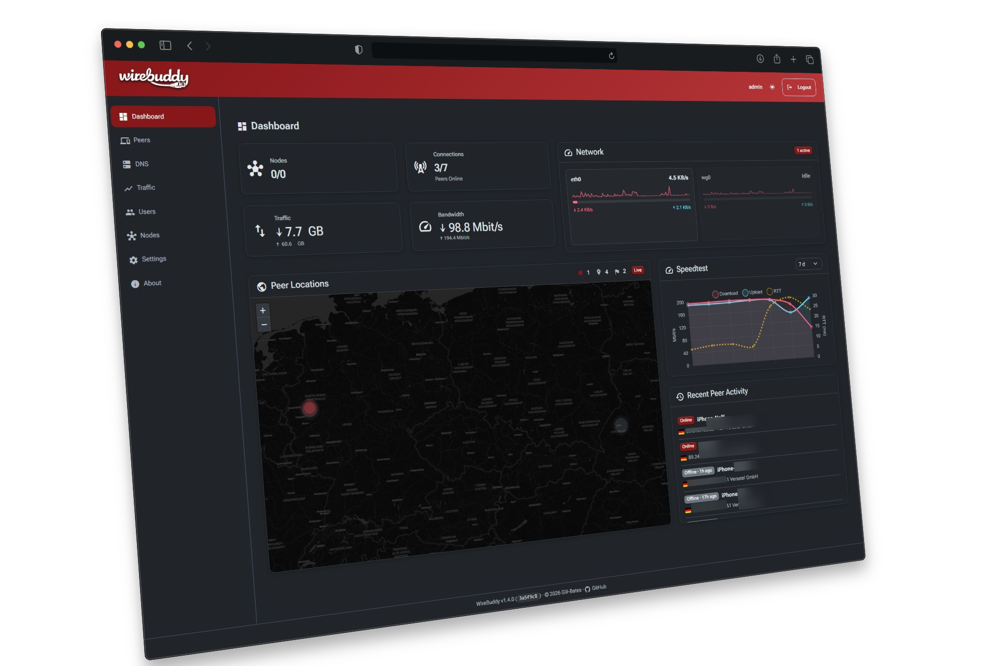
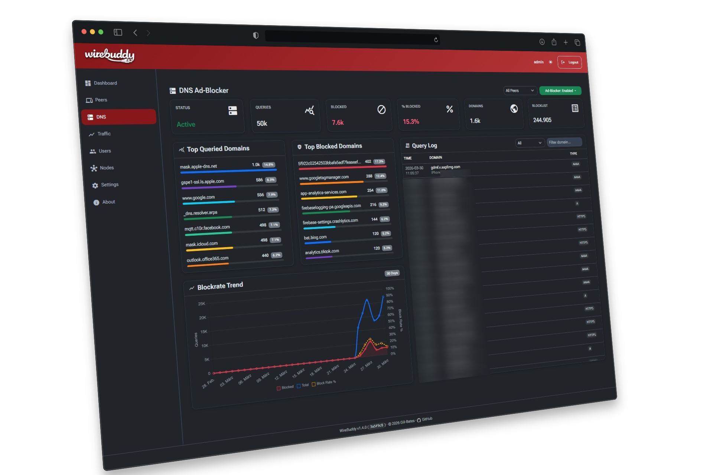
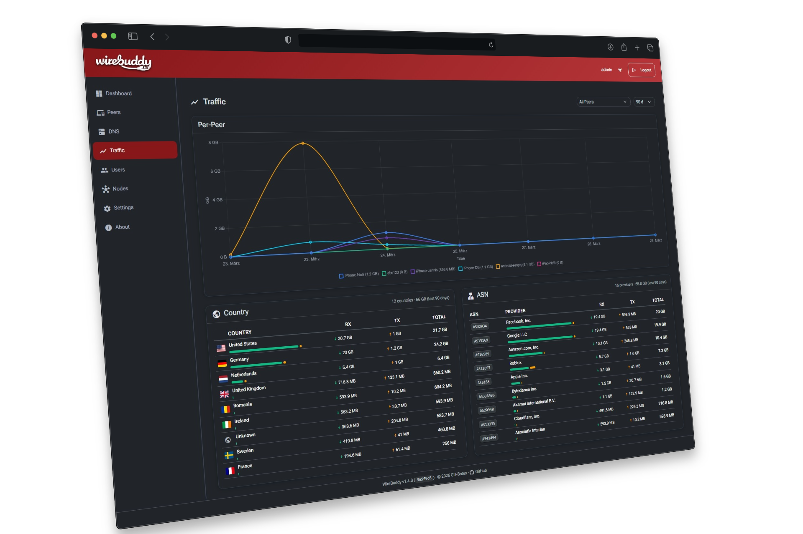

<p align="center">
  
  
</p>

<h2 align="center">Use WireGuard with ease!</h2>

<p align="center">
  <a href="https://github.com/Gill-Bates/wirebuddy/releases"></a>
  <a href="https://hub.docker.com/r/giiibates/wirebuddy"></a>
  <a href="https://hub.docker.com/r/giiibates/wirebuddy"></a>
  <br>
  <a href="LICENSE"></a>
  <a href="https://gill-bates.github.io/wirebuddy/"></a>
  
</p>

<p align="center">
  <a href="https://gill-bates.github.io/wirebuddy/">📚 Documentation</a> •
  <a href="https://gill-bates.github.io/wirebuddy/getting-started/quick-start/">🚀 Quick Start</a> •
  <a href="https://gill-bates.github.io/wirebuddy/changelog/">📋 Changelog</a>
</p>

---

## Screenshots

<p align="center">
  
</p>
<p align="center">
  
</p>
<p align="center">
  
</p>
<p align="center">
  
</p>

---

## ✨ Features

| Category | Highlights |
|---|---|
| 🔒 **WireGuard VPN** | Multi-interface management, automatic keypair generation, routing presets, client isolation, QR codes for mobile setup |
| � **Multi-Node** | Distributed VPN clusters, automatic peer sync, metrics aggregation, zero-config enrollment via SSE |
| �🌍 **DNS Ad-Blocking** | Integrated Unbound resolver with blocklists, DNS-over-TLS, real-time query log, DNSSEC, and per-peer filtering |
| 📊 **Monitoring** | Built-in time-series database, per-peer traffic charts, traffic analysis by country & ASN |
| 🗺️ **GeoIP** | MaxMind GeoLite2 integration, interactive heatmap, country flags & ASN badges |
| 🔐 **Let's Encrypt** | Built-in ACME client with HTTP-01 challenge, certificate management UI |
| 👥 **User Management** | Multi-user roles, Passkeys (WebAuthn) & MFA (TOTP), login tracking |
| 🎨 **Web UI** | Responsive Bootstrap 5, dark/light/auto theme, Material Icons |

---

## 🚀 Getting Started

```bash
docker pull giiibates/wirebuddy:latest
```

For installation, configuration, and security setup, see the **[Documentation](https://gill-bates.github.io/wirebuddy/)**.

---

## 📝 License

**GNU Affero General Public License v3.0** — see [LICENSE](LICENSE) for details.

---

<p align="center">
  Made with ☕ by <a href="https://github.com/Gill-Bates">Gill-Bates</a>
</p>
