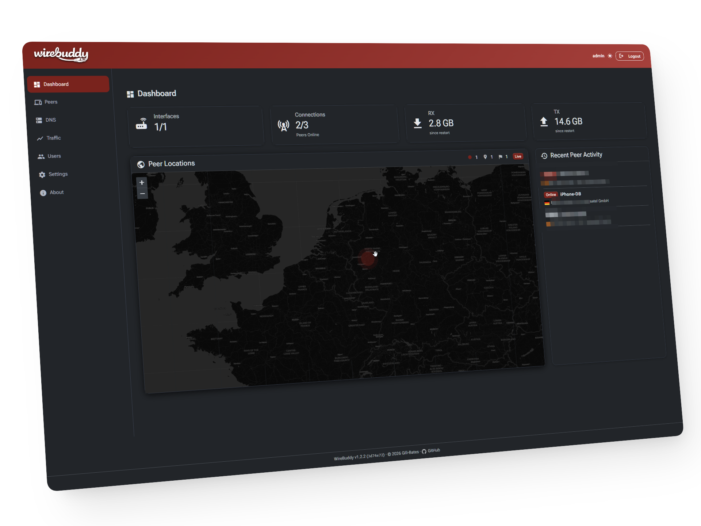
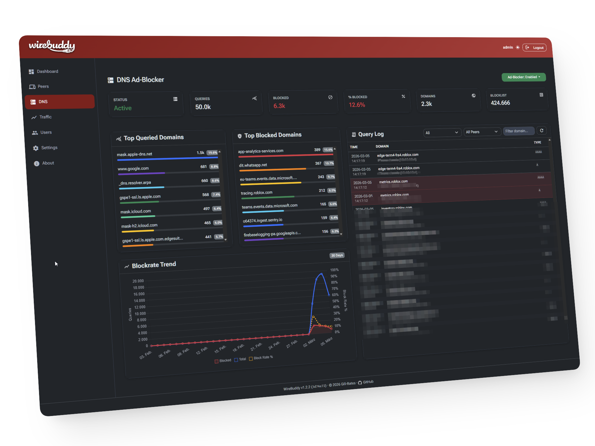
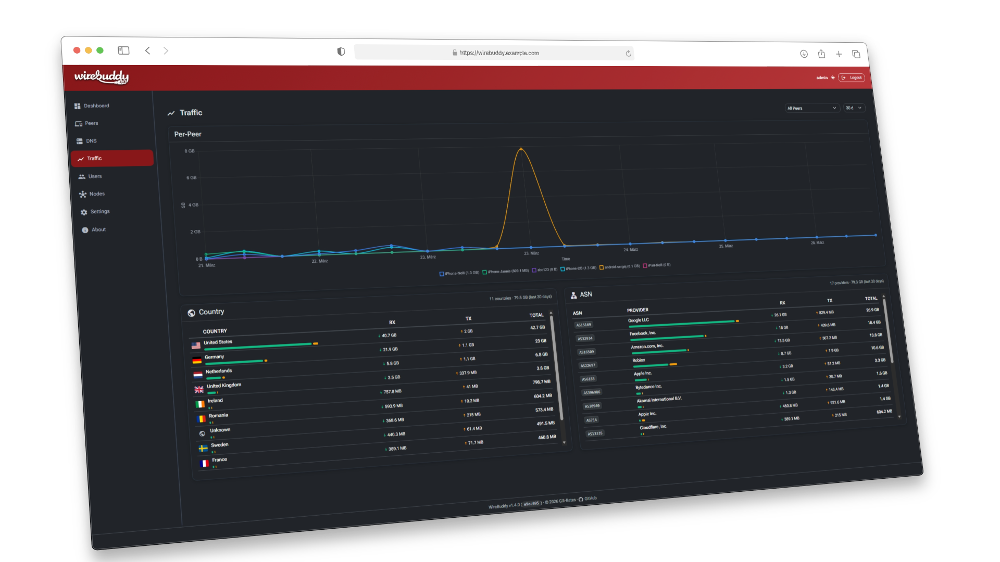

<p align="center">
  
  
</p>

<h2 align="center">Use Wireguard with ease!</h2>

<p align="center">
  <a href="https://hub.docker.com/r/giiibates/wirebuddy"></a>
  <a href="https://hub.docker.com/r/giiibates/wirebuddy"></a>
  <a href="https://hub.docker.com/r/giiibates/wirebuddy"></a>
  <br>
  <a href="LICENSE"></a>
  <a href="#-quick-start"></a>
</p>

<p align="center">
  <a href="#-quick-start">Quick Start</a> •
  <a href="#-features">Features</a> •
  <a href="#%EF%B8%8F-configuration">Configuration</a> •
  <a href="#-security">Security</a> •
  <a href="#-license">License</a>
</p>

---

## Screenshots

<p align="center">
  
</p>
<p align="center">
  
</p>
<p align="center">
  
</p>


## 🚀 Quick Start

### Docker (Recommended)

```bash
# Clone the repository
git clone https://github.com/Gill-Bates/wirebuddy.git
cd wirebuddy

# Copy and edit settings
cp .env-example settings.env
# Edit settings.env — set WIREBUDDY_SECRET_KEY!

# Run
docker compose up -d
```

WireBuddy requires `network_mode: host` to access the host's network stack
for WireGuard interface management and conntrack statistics. The web UI
listens on port **8000**. Place the container behind a reverse proxy (Caddy,
nginx, Traefik) or access it directly.

For your convenience, an example ``Caddyfile`` is included in this repository.

> **Default credentials:** `admin` / `admin`
> ⚠️ **Change the default password immediately after first login!**

#### Host Prerequisites

**IP Forwarding** must be enabled on the Docker host (required for WireGuard routing):

```bash
sudo sysctl -w net.ipv4.conf.all.forwarding=1
sudo sysctl -w net.ipv6.conf.all.forwarding=1

# Make persistent
cat <<EOF | sudo tee /etc/sysctl.d/99-wireguard.conf
net.ipv4.conf.all.forwarding = 1
net.ipv6.conf.all.forwarding = 1
EOF
```

**Traffic by Country & ASN** requires conntrack byte accounting:

```bash
# Enable byte accounting — takes effect immediately
sudo sysctl -w net.netfilter.nf_conntrack_acct=1

# Make persistent
echo "net.netfilter.nf_conntrack_acct = 1" | sudo tee -a /etc/sysctl.d/99-wireguard.conf
```

**Verify:**
```bash
cat /proc/sys/net/netfilter/nf_conntrack_acct
# → 1
```

Without this, the country and ASN traffic charts will show no data. WireBuddy logs a warning once when accounting is disabled, and automatically resumes sampling as soon as the value is set — no container restart needed.

### Local Development

```bash
python3.13 -m venv .venv && source .venv/bin/activate
pip install -r requirements.txt
python run.py
```

---

## ✨ Features

| Category | Highlights |
|---|---|
| 🔒 **WireGuard VPN** | Multi-interface management, automatic keypair generation, routing presets (Full Tunnel / Isolated / Custom), QR codes for mobile setup |
| 🌍 **DNS Ad-Blocking** | Integrated Unbound resolver with blocklists (StevenBlack, HaGeZi Pro), DNS-over-TLS, real-time query log, DNSSEC, Query-Log row actions (Block/Unblock global or per-client), client-scoped custom rules (`$client=`) |
| 📊 **Monitoring** | Built-in time-series database, per-peer traffic charts, connection status dashboard, traffic analysis by destination country & ASN, auto-refresh |
| 🗺️ **GeoIP** | MaxMind GeoLite2 integration, interactive map with heatmap, country flags & ASN badges |
| 🔐 **Let's Encrypt** | Built-in ACME client with HTTP-01 challenge, certificate management UI |
| 👥 **User Management** | Multi-user roles (admin/user), MFA (TOTP) for additional account protection, login tracking, token lifecycle |
| 🎨 **Web UI** | Responsive Bootstrap 5, dark/light/auto theme, Material Icons |

---

## ⚙️ Configuration

Environment variables (via `settings.env` or Docker env):

| Variable | Default | Description |
|---|---|---|
| `WIREBUDDY_SECRET_KEY` | *(required)* | Encryption key for secrets & sessions |
| `LOG_LEVEL` | `INFO` | Logging verbosity |
| `WIREBUDDY_SKIP_NETWORK_CHECK` | *(unset)* | Set to `1` to bypass host network mode verification (for CI/CD testing only) |

> **Note:** Data is stored in the `data/` directory relative to the application root. In Docker, mount your volume to `/app/data`.

### Internal Status Page (`/status`)

- Enable it in **Settings → General → Enable Status Page** (admin only).
- The endpoint is available at `/status` without login.
- Access is restricted to WireGuard-internal client IPs; requests from outside return `403 Forbidden`.
- If disabled, `/status` returns a defined disabled response (`404` with a lightweight page).

---

## 🛡️ Security

| Layer | Implementation |
|---|---|
| **Passwords** | PBKDF2-SHA256, 600 000 iterations, random salt |
| **Secrets at rest** | Fernet encryption (PBKDF2 + per-row salt + app pepper) |
| **Auth tokens** | SHA-256 hashed before storage, expiry enforced |
| **CSRF** | Double-submit cookie + Origin header validation |
| **Brute-force** | Rate limiting + progressive IP lockout with backoff |
| **Proxy trust** | `X-Forwarded-For` automatically trusted from private/loopback addresses (e.g. local reverse proxy); no manual configuration required |
| **Input validation** | Strict regex for interface names; Pydantic for all payloads |
| **Container** | `no-new-privileges`, minimal capabilities (`NET_ADMIN`) |

---

## 📝 License

This project is licensed under the **GNU Affero General Public License v3.0** — see [LICENSE](LICENSE) for details.

---

<p align="center">
  Made with ☕ by <a href="https://github.com/Gill-Bates">Gill-Bates</a> | © 2026
</p>
