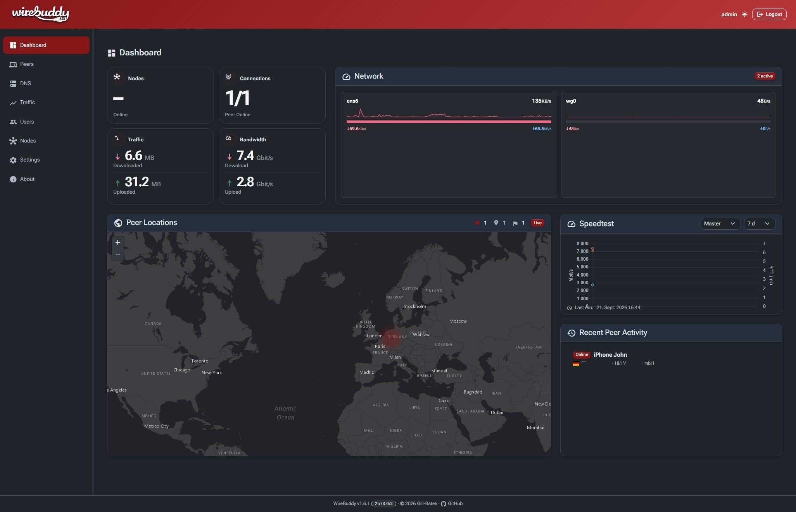
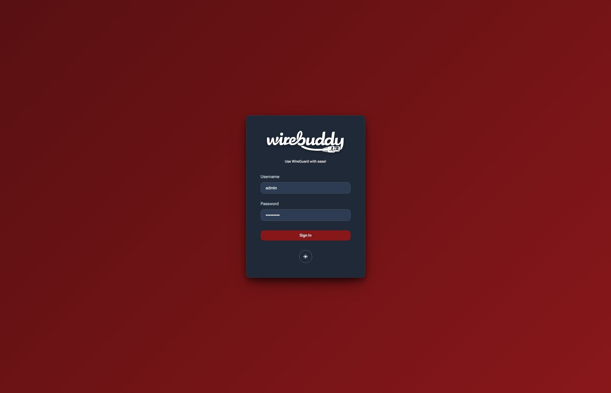
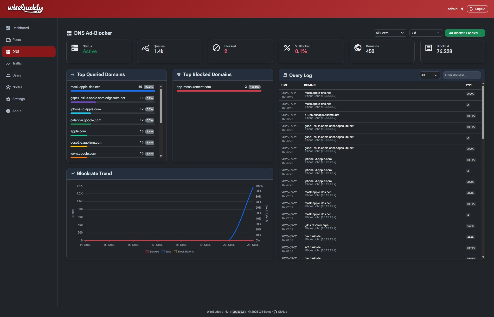
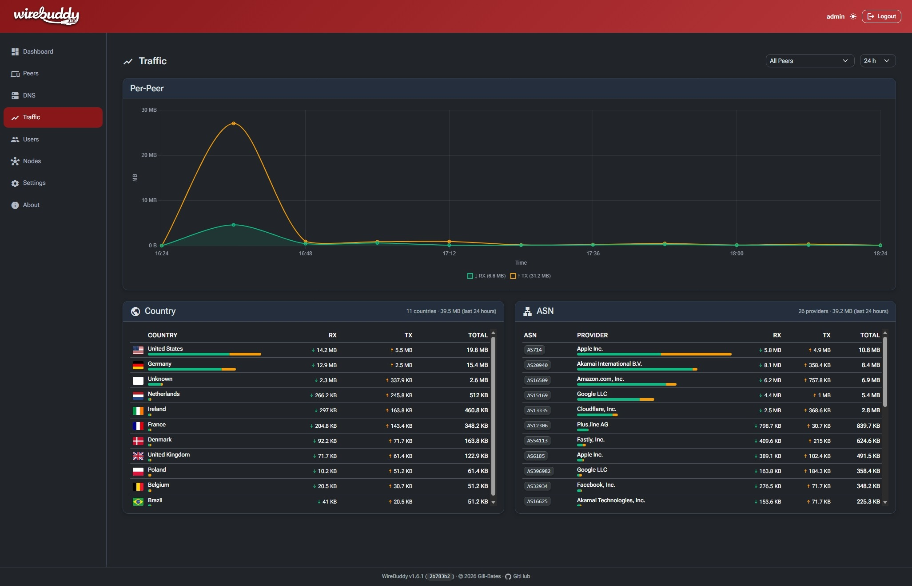
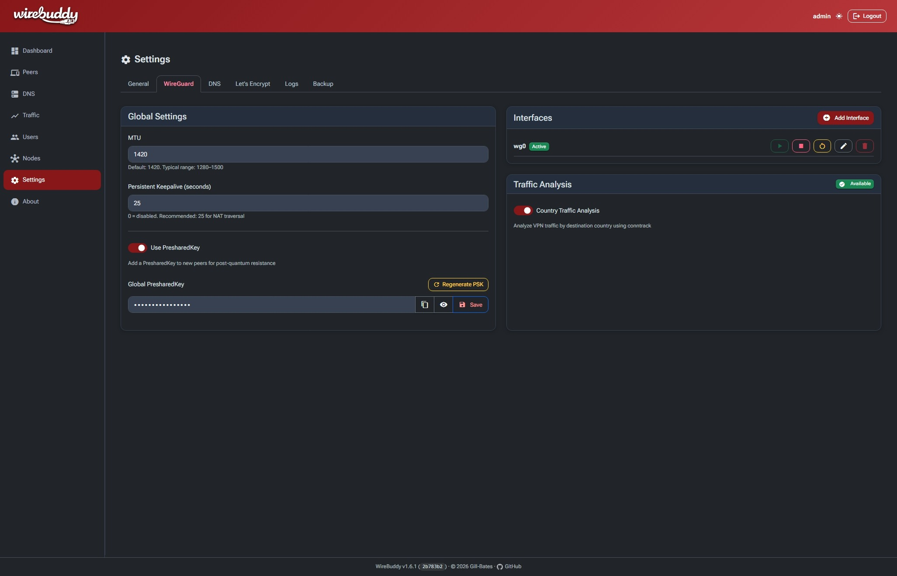
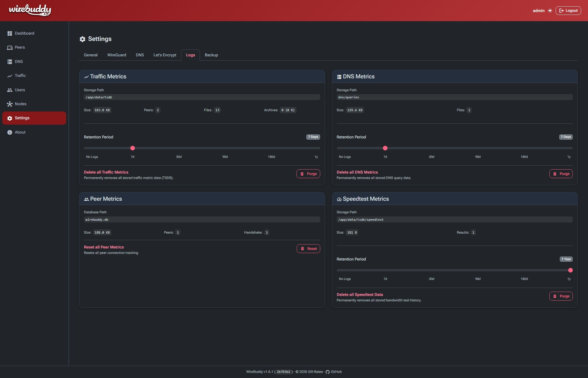

<p align="center">
  
  
</p>

<h2 align="center">Use WireGuard with ease!</h2>

<p align="center">
  <a href="https://github.com/Gill-Bates/wirebuddy/releases"></a>
  <a href="https://hub.docker.com/r/giiibates/wirebuddy"></a>
  <a href="https://hub.docker.com/r/giiibates/wirebuddy"></a>
  <br>
  <a href="LICENSE"></a>
  <a href="https://gill-bates.github.io/wirebuddy/"></a>
  
</p>

<p align="center">
  <a href="https://gill-bates.github.io/wirebuddy/">📚 Documentation</a> •
  <a href="https://gill-bates.github.io/wirebuddy/getting-started/quick-start/">🚀 Quick Start</a> •
  <a href="https://gill-bates.github.io/wirebuddy/changelog/">📋 Changelog</a>
</p>

---

## Screenshots

<p align="center">
  <br>
  <em>Dashboard — network status, peer locations, and speedtest history at a glance.</em>
</p>

<details>
  <summary align="center"><b>More screenshots</b></summary>
  <br>
  <p align="center">
    <br>
    <em>Login — dark/light theme toggle, no account enumeration on failed attempts.</em>
  </p>
  <p align="center">
    <br>
    <em>Traffic — per-peer RX/TX charts with destination breakdown by country and ASN.</em>
  </p>
  <p align="center">
    <br>
    <em>DNS Ad-Blocker — live query log, top blocked domains, and block-rate trend.</em>
  </p>
  <p align="center">
    <br>
    <em>WireGuard Settings — global tunnel defaults, interface management, and traffic analysis.</em>
  </p>
  <p align="center">
    <br>
    <em>Logs — per-dataset retention and storage stats, with one-click purge.</em>
  </p>
</details>

---

## ✨ Features

| Category | Highlights |
|---|---|
|  **WireGuard VPN** | Multi-interface management, automatic keypair generation, routing presets, client isolation, QR codes for mobile setup |
|  **Multi-Node** | Distributed VPN clusters, automatic peer sync, metrics aggregation, token-based enrollment, real-time sync via SSE |
|  **DNS Ad-Blocking** | Integrated Unbound resolver with blocklists, DNS-over-TLS, real-time query log, DNSSEC, and per-peer filtering |
|  **Monitoring** | Built-in time-series database, per-peer traffic charts, traffic analysis by country & ASN |
|  **GeoIP** | MaxMind GeoLite2 integration, interactive heatmap, country flags & ASN badges |
|  **HTTPS & Certificates** | Built-in HTTPS with self-signed or Let's Encrypt certificates, HTTP-01 validation, and certificate management |
|  **User Management** | Multi-user roles, Passkeys (WebAuthn) & MFA (TOTP), login tracking |
|  **Web UI** | Responsive Bootstrap 5, dark/light/auto theme, Material Icons |

---

## 🚀 Getting Started

```bash
docker pull giiibates/wirebuddy:latest
```

For production Docker deployments, WireBuddy expects Linux with `network_mode: host`.

The default setup serves the GUI over HTTP. To use WireBuddy's built-in HTTPS,
enable **Settings → General → Serve GUI over HTTPS**, then restart the
container. It uses a self-signed certificate until you obtain a Let's Encrypt
certificate in **Settings → Let's Encrypt**.

For installation, configuration, and security setup, see the **[Documentation](https://gill-bates.github.io/wirebuddy/)**.

---

## License

Released under the [MIT License](LICENSE).

<p align="center">
  <a href="https://www.buymeacoffee.com/tnsteinerx">
    
  </a>
</p>
