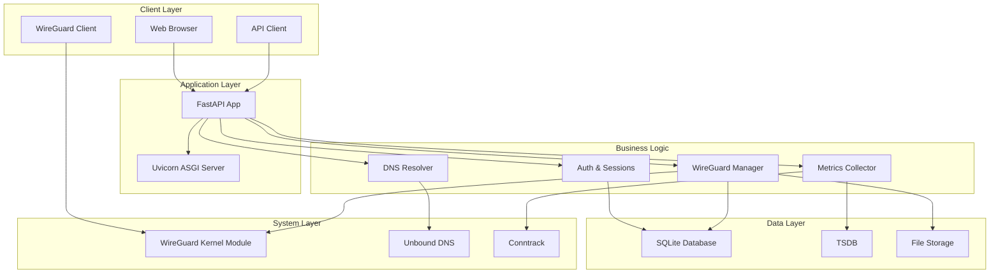
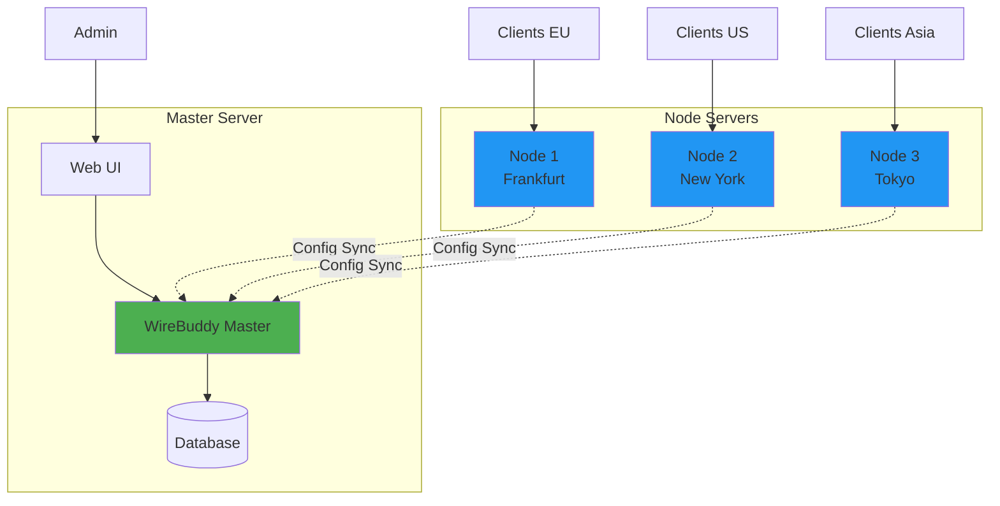
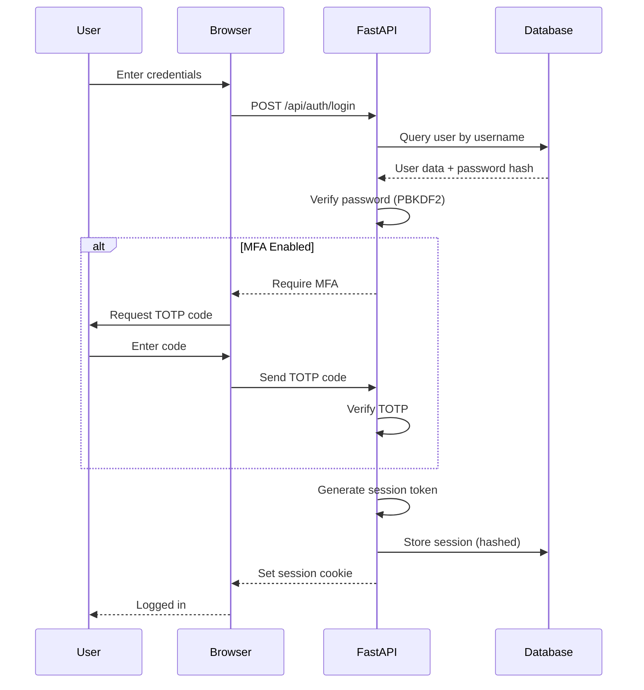

# Architecture

WireBuddy system architecture and design decisions.

## High-Level Architecture



## Multi-Node Architecture

WireBuddy supports deploying multiple WireGuard nodes across different geographic locations while maintaining centralized management. See [Multi-Node Deployment](../features/multi-node.md) for details.



**Key Components:**

- **Master**: Full application with web UI, API, and database
- **Nodes**: Lightweight WireGuard-only servers with sync daemon
- **Sync Protocol**: HTTPS with mutual certificate authentication
- **Config Distribution**: Pull-based model with version tracking

## Technology Stack

| Component | Technology | Purpose |
|-----------|-----------|---------|
| **Web Framework** | FastAPI | REST API and web interface |
| **ASGI Server** | Uvicorn | High-performance async server |
| **Database** | SQLite3 | Configuration and user data |
| **Time-Series DB** | Custom TSDB | Metrics storage |
| **Template Engine** | Jinja2 | HTML rendering |
| **VPN** | WireGuard | VPN server |
| **DNS** | Unbound | DNS resolver |
| **Frontend** | Bootstrap 5 | Responsive UI |
| **Charts** | Chart.js | Traffic visualization |
| **Icons** | Material Icons | Icon set |

## Application Structure

### FastAPI Application

```python
# app/main.py
from fastapi import FastAPI
from fastapi.staticfiles import StaticFiles
from fastapi.templating import Jinja2Templates

app = FastAPI(title="WireBuddy")

# Mount static files
app.mount("/static", StaticFiles(directory="app/static"), name="static")

# Template engine
templates = Jinja2Templates(directory="app/templates")

# Include routers
app.include_router(auth_router, prefix="/api/auth", tags=["auth"])
app.include_router(wireguard_router, prefix="/api/wireguard", tags=["wireguard"])
# ...
```

### Router Pattern

```python
# app/api/wireguard.py
from fastapi import APIRouter, Depends
from app.models import PeerCreate, PeerResponse
from app.db import get_db

router = APIRouter()

@router.post("/peers", response_model=PeerResponse)
async def create_peer(
    peer: PeerCreate,
    db = Depends(get_db),
    user = Depends(get_current_user)
):
    # Validate
    # Create peer
    # Return response
    pass
```

## Database Schema

### Users Table

```sql
CREATE TABLE users (
    id INTEGER PRIMARY KEY AUTOINCREMENT,
    username TEXT UNIQUE NOT NULL,
    email TEXT UNIQUE,
    password_hash TEXT NOT NULL,
    salt TEXT NOT NULL,
    role TEXT NOT NULL DEFAULT 'user',
    totp_secret TEXT,
    created_at INTEGER NOT NULL,
    updated_at INTEGER NOT NULL,
    disabled INTEGER DEFAULT 0
);
```

### Interfaces Table

```sql
CREATE TABLE interfaces (
    id INTEGER PRIMARY KEY AUTOINCREMENT,
    name TEXT UNIQUE NOT NULL,
    address TEXT NOT NULL,
    listen_port INTEGER NOT NULL,
    private_key TEXT NOT NULL,
    public_key TEXT NOT NULL,
    status TEXT DEFAULT 'inactive',
    created_at INTEGER NOT NULL
);
```

### Peers Table

```sql
CREATE TABLE peers (
    id TEXT PRIMARY KEY,
    name TEXT NOT NULL,
    interface TEXT NOT NULL,
    ip TEXT NOT NULL,
    public_key TEXT NOT NULL,
    private_key TEXT NOT NULL,
    preshared_key TEXT,
    allowed_ips TEXT NOT NULL,
    persistent_keepalive INTEGER DEFAULT 0,
    enabled INTEGER DEFAULT 1,
    created_at INTEGER NOT NULL,
    FOREIGN KEY (interface) REFERENCES interfaces(name)
);
```

### Sessions Table

```sql
CREATE TABLE sessions (
    id TEXT PRIMARY KEY,
    user_id INTEGER NOT NULL,
    token_hash TEXT UNIQUE NOT NULL,
    ip_address TEXT,
    user_agent TEXT,
    created_at INTEGER NOT NULL,
    expires_at INTEGER NOT NULL,
    FOREIGN KEY (user_id) REFERENCES users(id)
);
```

## Authentication Flow



## WireGuard Management

### Configuration Generation

```python
def generate_interface_config(interface: Interface) -> str:
    config = f"""[Interface]
PrivateKey = {interface.private_key}
Address = {interface.address}
ListenPort = {interface.listen_port}
"""
    
    # Add peers
    for peer in interface.peers:
        config += f"""
[Peer]
PublicKey = {peer.public_key}
AllowedIPs = {peer.allowed_ips}
"""
        if peer.preshared_key:
            config += f"PresharedKey = {peer.preshared_key}\n"
        if peer.persistent_keepalive:
            config += f"PersistentKeepalive = {peer.persistent_keepalive}\n"
    
    return config
```

### Interface Management

```python
class WireGuardManager:
    def start_interface(self, name: str):
        # Generate config
        config = self.generate_config(name)
        
        # Write to file
        config_path = f"/etc/wireguard/{name}.conf"
        with open(config_path, 'w') as f:
            f.write(config)
        
        # Start with wg-quick
        subprocess.run(["wg-quick", "up", name], check=True)
    
    def stop_interface(self, name: str):
        subprocess.run(["wg-quick", "down", name], check=True)
```

## DNS Integration

### Unbound Configuration

```python
def generate_unbound_config(settings: DNSSettings) -> str:
    config = """
server:
    verbosity: 1
    interface: 10.8.0.1
    port: 53
    do-ip4: yes
    do-ip6: yes
    do-udp: yes
    do-tcp: yes
    
    # Performance
    num-threads: 4
    msg-cache-size: 50m
    rrset-cache-size: 100m
    
    # Security
    hide-identity: yes
    hide-version: yes
    qname-minimisation: yes
"""
    
    # Add blocklists
    for domain in settings.blocked_domains:
        config += f'    local-zone: "{domain}" always_refuse\n'
    
    # DoT upstream
    if settings.dot_enabled:
        config += """
forward-zone:
    name: "."
    forward-tls-upstream: yes
    forward-addr: 1.1.1.1@853#cloudflare-dns.com
"""
    
    return config
```

### Query Logging

```python
class DNSQueryLogger:
    def __init__(self, log_path: str):
        self.log_path = log_path
        self.tailer = FileTailer(log_path)
    
    async def stream_queries(self):
        async for line in self.tailer:
            query = self.parse_query(line)
            yield query
    
    def parse_query(self, line: str) -> DNSQuery:
        # Parse Unbound log format
        # Return structured query object
        pass
```

## Metrics Collection

### Conntrack Monitoring

```python
class ConntrackMonitor:
    def __init__(self):
        self.conntrack_path = "/proc/net/nf_conntrack"
    
    def collect_peer_traffic(self, peer_ip: str) -> dict:
        traffic = {"tx": 0, "rx": 0}
        
        with open(self.conntrack_path) as f:
            for line in f:
                # Parse conntrack entry
                if peer_ip in line:
                    entry = self.parse_entry(line)
                    traffic["tx"] += entry.bytes_orig
                    traffic["rx"] += entry.bytes_reply
        
        return traffic
```

### Time-Series Database

```python
class TSDB:
    def __init__(self, path: str):
        self.db = sqlite3.connect(path)
        self.init_schema()
    
    def record_metric(self, metric: str, value: float, tags: dict):
        timestamp = int(time.time())
        self.db.execute(
            "INSERT INTO metrics (timestamp, metric, value, tags) VALUES (?, ?, ?, ?)",
            (timestamp, metric, value, json.dumps(tags))
        )
        self.db.commit()
    
    def query(self, metric: str, start: int, end: int) -> list:
        cursor = self.db.execute(
            "SELECT timestamp, value FROM metrics WHERE metric = ? AND timestamp BETWEEN ? AND ?",
            (metric, start, end)
        )
        return cursor.fetchall()
```

## Security Architecture

### Password Hashing

```python
def hash_password(password: str) -> tuple[bytes, bytes]:
    salt = os.urandom(32)
    kdf = PBKDF2HMAC(
        algorithm=hashes.SHA256(),
        length=32,
        salt=salt,
        iterations=600_000
    )
    key = kdf.derive(password.encode())
    return salt, key
```

### Secret Encryption

```python
class SecretVault:
    def __init__(self, master_key: str):
        self.master_key = master_key
    
    def encrypt(self, plaintext: str, salt: bytes) -> str:
        kdf = PBKDF2HMAC(
            algorithm=hashes.SHA256(),
            length=32,
            salt=salt,
            iterations=100_000
        )
        key = base64.urlsafe_b64encode(kdf.derive(self.master_key.encode()))
        f = Fernet(key)
        return f.encrypt(plaintext.encode()).decode()
    
    def decrypt(self, ciphertext: str, salt: bytes) -> str:
        kdf = PBKDF2HMAC(
            algorithm=hashes.SHA256(),
            length=32,
            salt=salt,
            iterations=100_000
        )
        key = base64.urlsafe_b64encode(kdf.derive(self.master_key.encode()))
        f = Fernet(key)
        return f.decrypt(ciphertext.encode()).decode()
```

## Frontend Architecture

### JavaScript Structure

```javascript
// app/static/js/main.js
const WireBuddy = {
    init() {
        this.setupEventListeners();
        this.loadDashboard();
    },
    
    async loadDashboard() {
        const response = await fetch('/api/metrics/dashboard');
        const data = await response.json();
        this.updateDashboard(data);
    },
    
    updateDashboard(data) {
        document.getElementById('peer-count').textContent = data.peers.total;
        // ...
    }
};

document.addEventListener('DOMContentLoaded', () => WireBuddy.init());
```

### Chart Integration

```javascript
const TrafficChart = {
    chart: null,
    
    init(canvasId) {
        const ctx = document.getElementById(canvasId).getContext('2d');
        this.chart = new Chart(ctx, {
            type: 'line',
            data: { /* ... */ },
            options: { /* ... */ }
        });
    },
    
    update(data) {
        this.chart.data.datasets[0].data = data;
        this.chart.update();
    }
};
```

## Deployment Architecture

### Docker Container

```dockerfile
FROM python:3.13-slim

# Install system dependencies
RUN apt-get update && apt-get install -y \
    wireguard-tools \
    unbound \
    conntrack \
    && rm -rf /var/lib/apt/lists/*

# Copy application
WORKDIR /app
COPY requirements.txt .
RUN pip install --no-cache-dir -r requirements.txt
COPY . .

# Non-root user
RUN useradd -m wirebuddy
USER wirebuddy

# Start application
CMD ["uvicorn", "app.main:app", "--host", "0.0.0.0", "--port", "8000"]
```

### Docker Compose

```yaml
services:
  wirebuddy:
    image: giiibates/wirebuddy:latest
    network_mode: host
    cap_add:
      - NET_ADMIN
    volumes:
      - ./data:/app/data
    env_file:
      - settings.env
```

## Performance Considerations

### Database Optimization

- SQLite WAL mode for concurrent reads
- Indexes on frequently queried columns
- Connection pooling (AsyncIO)

### Caching

- DNS query cache (Unbound)
- Session cache (in-memory)
- Metrics cache (Redis in future)

### Async Operations

- FastAPI async handlers
- Async database queries (aiosqlite)
- Background tasks (BackgroundTasks)

## Scalability

### Current Limitations

- Single-server deployment
- SQLite (not distributed)
- No horizontal scaling

### Future Enhancements

- PostgreSQL support
- Redis for caching
- Distributed mode (multiple workers)
- Metrics persistence (InfluxDB, Prometheus)

## Monitoring & Observability

### Logging

- Structured logging (JSON)
- Log levels (DEBUG, INFO, WARNING, ERROR)
- Audit logs (security events)

### Metrics (Future)

- Prometheus exporter
- Grafana dashboards
- Custom alerts

## Design Decisions

### Why SQLite?

✅ **Pros:**
- Simple deployment (no separate DB server)
- Fast for single-server workload
- Embedded, no maintenance
- ACID compliant

❌ **Cons:**
- No network access (must be local)
- Limited concurrent writes
- No replication

### Why FastAPI?

✅ **Pros:**
- Modern async framework
- Automatic OpenAPI docs
- Type hints and validation
- High performance

### Why Unbound?

✅ **Pros:**
- Lightweight and fast
- DNSSEC support
- Easy configuration
- Well-tested and secure

## Next Steps

- [Development Setup](setup.md) - Local development
- [Contributing](contributing.md) - Contribution guidelines
