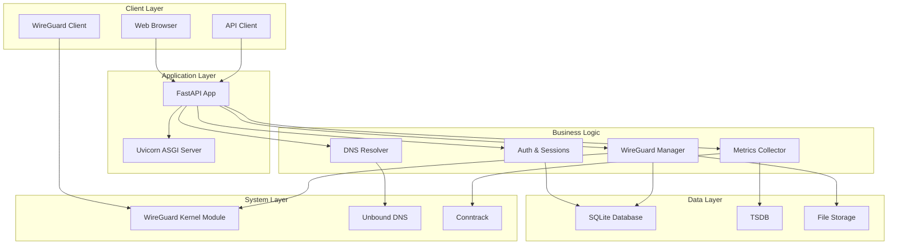
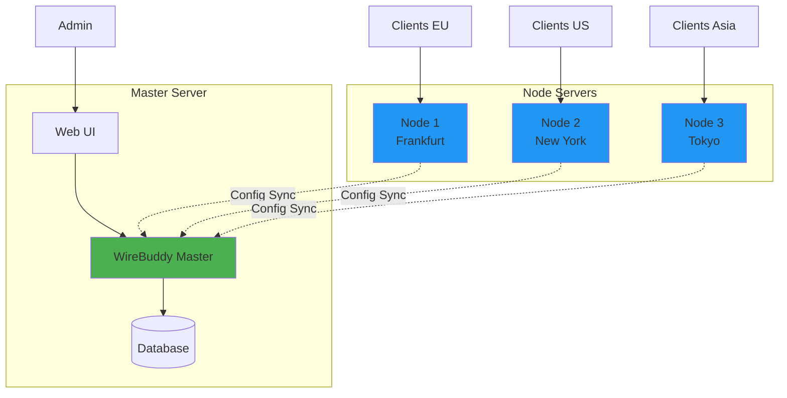
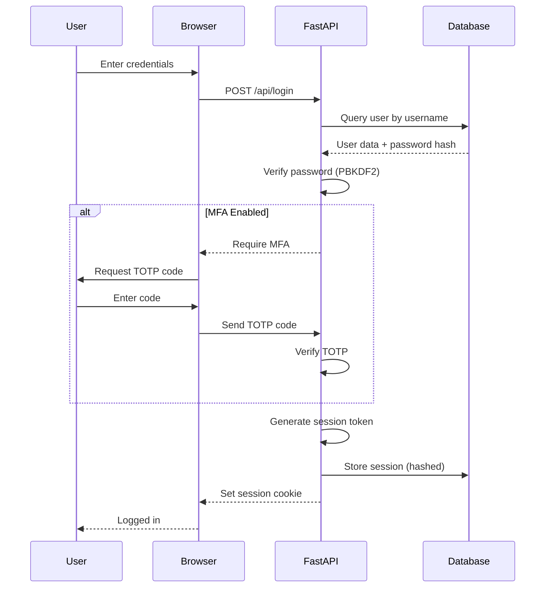

# Architecture

WireBuddy system architecture and design decisions.

## High-Level Architecture


```mermaid
graph TB
    subgraph "Client Layer"
        A[Web Browser]
        B[WireGuard Client]
        C[API Client]
    end
    
    subgraph "Application Layer"
        D[FastAPI App]
        E[Uvicorn ASGI Server]
    end
    
    subgraph "Business Logic"
        F[Auth & Sessions]
        G[WireGuard Manager]
        H[DNS Resolver]
        I[Metrics Collector]
    end
    
    subgraph "Data Layer"
        J[SQLite Database]
        K[TSDB]
        L[File Storage]
    end
    
    subgraph "System Layer"
        M[WireGuard Kernel Module]
        N[Unbound DNS]
        O[Conntrack]
    end
    
    A --> D
    C --> D
    B --> M
    D --> E
    D --> F
    D --> G
    D --> H
    D --> I
    F --> J
    G --> J
    G --> M
    H --> N
    I --> K
    I --> O
    G --> L
```

## Multi-Node Architecture

WireBuddy supports deploying multiple WireGuard nodes across different geographic locations while maintaining centralized management. See [Multi-Node Deployment](../features/multi-node.md) for details.


```mermaid
graph TB
    subgraph "Master Server"
        M[WireBuddy Master]
        DB[(Database)]
        UI[Web UI]
    end
    
    subgraph "Node Servers"
        N1[Node 1<br/>Frankfurt]
        N2[Node 2<br/>New York]
        N3[Node 3<br/>Tokyo]
    end
    
    Admin[Admin] --> UI
    UI --> M
    M --> DB
    
    N1 -.Config Sync.-> M
    N2 -.Config Sync.-> M
    N3 -.Config Sync.-> M
    
    C1[Clients EU] --> N1
    C2[Clients US] --> N2
    C3[Clients Asia] --> N3
    
    style M fill:#4CAF50
    style N1 fill:#2196F3
    style N2 fill:#2196F3
    style N3 fill:#2196F3
```

**Key Components:**

- **Master**: Full application with web UI, API, and database
- **Nodes**: Lightweight WireGuard-only servers with sync daemon
- **Sync Protocol**: HTTPS with mutual certificate authentication
- **Config Distribution**: Pull-based model with version tracking

## Technology Stack

| Component | Technology | Purpose |
|-----------|-----------|---------|
| **Web Framework** | FastAPI | REST API and web interface |
| **ASGI Server** | Uvicorn | High-performance async server |
| **Database** | SQLite3 | Configuration and user data |
| **Time-Series DB** | Custom TSDB | Metrics storage |
| **Template Engine** | Jinja2 | HTML rendering |
| **VPN** | WireGuard | VPN server |
| **DNS** | Unbound | DNS resolver |
| **Frontend** | Bootstrap 5 | Responsive UI |
| **Charts** | Chart.js | Traffic visualization |
| **Icons** | Material Icons | Icon set |

## Application Structure

### FastAPI Application

`app/main.py` exposes an application **factory**, `create_app()`, not a
module-level `app` object. It loads configuration, mounts `app/static`, wires the
Jinja2 environment for `app/templates`, includes the routers from `app/api/`, and
delegates startup/shutdown to the lifespan defined in the same module. Entry
points therefore reference it as a factory:

```bash
uvicorn app:create_app --factory --host 0.0.0.0 --port 8000
```

Service startup and shutdown are being moved into `app/runtime/` — see
[Runtime Architecture Migration](runtime-migration.md).

### Router Pattern

Routers live in `app/api/` and are split by resource rather than by one module
per prefix (`wireguard_peers.py`, `wireguard_interfaces_crud.py`,
`wireguard_stats_country.py`, and so on). Handlers take their database
connection and authorization through `Depends`, declare a rate-limit class, and
return the generic `OkResponse[...]` envelope:

```python
# app/api/wireguard_peers.py
@router.post("/peers", status_code=201, response_model=OkResponse[PeerPublic])
@limiter.limit(RATE_LIMIT_HEAVY)
async def create_peer(
	request: Request,
	payload: PeerCreate,
	conn: sqlite3.Connection = Depends(get_conn),
	tsdb_dir: Path = Depends(get_tsdb_dir),
	_: sqlite3.Row = Depends(require_admin),
):
	...
```

`Depends(require_admin)` is what makes a route admin-only; read-only routes use
`Depends(get_current_user)` instead. Blocking SQLite and subprocess work is
handed to a worker thread with `run_in_threadpool` so the event loop stays
responsive.

## Database Schema

The baseline schema lives in `app/db/sqlite_schema.py` (`init_schema()`); this
section shows the core tables in abbreviated form. See that module for the
authoritative column list, constraints, and indexes.

### Users Table

```sql
CREATE TABLE users (
    id INTEGER PRIMARY KEY AUTOINCREMENT,
    username TEXT NOT NULL UNIQUE,
    password_hash TEXT NOT NULL,
    is_admin INTEGER NOT NULL DEFAULT 0 CHECK (is_admin IN (0, 1)),
    is_active INTEGER NOT NULL DEFAULT 1 CHECK (is_active IN (0, 1)),
    must_change_password INTEGER NOT NULL DEFAULT 0,
    otp_secret TEXT,
    otp_enabled INTEGER NOT NULL DEFAULT 0,
    otp_recovery_codes TEXT,
    auth_method TEXT NOT NULL DEFAULT 'password',
    passkey_enabled INTEGER NOT NULL DEFAULT 0,
    last_login_at timestamp,
    last_login_ip TEXT,
    created_at timestamp NOT NULL
);
```

### Interfaces Table

```sql
CREATE TABLE interfaces (
    id INTEGER PRIMARY KEY AUTOINCREMENT,
    name TEXT NOT NULL UNIQUE,
    private_key TEXT NOT NULL,
    public_key TEXT NOT NULL,
    address TEXT NOT NULL,
    address6 TEXT,
    listen_port INTEGER NOT NULL DEFAULT 51820,
    client_endpoint_port INTEGER
    -- additional columns: see app/db/sqlite_schema.py
);
```

### Peers Table

```sql
CREATE TABLE peers (
    id INTEGER PRIMARY KEY AUTOINCREMENT,
    public_key TEXT NOT NULL UNIQUE,
    private_key TEXT,
    preshared_key TEXT,
    name TEXT,
    allowed_ips TEXT NOT NULL,
    allowed_ips_mode TEXT NOT NULL DEFAULT 'full',
    peer_address TEXT,
    endpoint TEXT,
    interface TEXT NOT NULL DEFAULT 'wg0',
    is_enabled INTEGER NOT NULL DEFAULT 1,
    use_adblocker INTEGER NOT NULL DEFAULT 1,
    cumulative_rx INTEGER NOT NULL DEFAULT 0,
    cumulative_tx INTEGER NOT NULL DEFAULT 0,
    node_id TEXT REFERENCES nodes(id) ON DELETE SET NULL,
    created_at timestamp NOT NULL,
    updated_at timestamp NOT NULL
);
```

### Auth Tokens Table

Session tokens are stored hashed, never in plaintext:

```sql
CREATE TABLE auth_tokens (
    id INTEGER PRIMARY KEY AUTOINCREMENT,
    user_id INTEGER NOT NULL,
    token_hash TEXT NOT NULL UNIQUE,
    expires_at timestamp NOT NULL,      -- idle expiry (1 hour, refreshed on use)
    max_expires_at timestamp NOT NULL,  -- absolute expiry (24 hours)
    created_at timestamp NOT NULL,
    FOREIGN KEY(user_id) REFERENCES users(id) ON DELETE CASCADE
);
```

## Authentication Flow


```mermaid
sequenceDiagram
    participant U as User
    participant B as Browser
    participant API as FastAPI
    participant DB as Database
    
    U->>B: Enter credentials
    B->>API: POST /api/login
    API->>DB: Query user by username
    DB-->>API: User data + password hash
    API->>API: Verify password (PBKDF2)
    alt MFA Enabled
        API-->>B: Require MFA
        B->>U: Request TOTP code
        U->>B: Enter code
        B->>API: Send TOTP code
        API->>API: Verify TOTP
    end
    API->>API: Generate session token
    API->>DB: Store session (hashed)
    API-->>B: Set session cookie
    B-->>U: Logged in
```

## WireGuard Management

Peer and interface configuration rendering lives in `app/api/wireguard_config.py`;
interface lifecycle (create, start, stop, restart, delete, plus the generated
NAT/forward/DNS hooks) lives in `app/api/wireguard_interfaces_crud.py`, and
client-isolation rules in `app/api/wireguard_isolation.py`. Interfaces are driven
through `wg-quick` against a generated `/etc/wireguard/<name>.conf`, so the
generated file — not in-process state — is the source of truth for the kernel.

Custom `PostUp`/`PostDown` hooks are validated before they are written, because
`wg-quick` runs them through a shell as root. See
[Custom hook validation](../configuration/wireguard.md#custom-hook-validation)
for the accepted grammar.

## DNS Integration

### Unbound Configuration

`app/dns/unbound_config.py` renders the resolver configuration and
`app/dns/unbound_blocklist.py` builds the blocklist zone data; shared literals
live in `app/dns/unbound_constants.py` and AdGuard-syntax parsing in
`app/dns/custom_rules.py`. The process itself is supervised by
`app/dns/unbound_process.py`.

The resolver binds only the WireGuard gateway addresses, never `127.0.0.1`, so it
cannot collide with a host resolver under `network_mode: host`. Upstreams are
configured as DNS-over-TLS `forward-zone` entries.

### Query Logging

Ingestion of the Unbound query log is split across `app/dns/ingestion*.py`:
`ingestion_tailer.py` follows the log file, `ingestion_parser.py` turns lines into
structured events, `ingestion_writer.py` persists them, `ingestion_retention.py`
enforces retention, and `ingestion_daemon.py` runs the loop.

WireBuddy uses dual storage for DNS telemetry:

- **JSONL files:** append-only raw query logs for the log UI, audits, and debugging
- **TSDB series:** write-time minute aggregates for trend charts and other read-heavy views
  - `queries_total` — integer counter per minute bucket
  - `queries_blocked` — integer counter per minute bucket

Separate counters (vs. pre-computed ratios) are more precise and flexible for UI aggregation.

This split keeps the ingestion path robust while making long-range trend queries cheap.

## Metrics Collection

### Conntrack Monitoring

`app/utils/conntrack.py` reads the host's conntrack table and
`app/api/wireguard_stats_country.py` attributes the resulting byte deltas to peers
and then to destination country/ASN via the GeoLite2 databases. Byte accounting
requires `net.netfilter.nf_conntrack_acct=1` on the host; without it flows are
visible but carry no byte counters. Sampling runs every 30 seconds.

### Time-Series Database

`app/db/tsdb.py` implements the metrics store. It is **not** SQLite — it is a
file-based, append-oriented series store under `<WIREBUDDY_DATA_DIR>/tsdb/`, with
compaction into archives during periodic maintenance (every six hours). That
layout keeps the hot ingestion path to appends and keeps long-range queries off
the application database.

Retention per series is configured in the UI under **Settings → Logs**; see
[Monitoring Configuration](../configuration/monitoring.md#retention).

## Security Architecture

### Password Hashing

`app/utils/crypto.py` hashes with PBKDF2-HMAC-SHA256 at 600,000 iterations and a
random per-password salt, and stores the parameters alongside the digest so the
work factor can be raised later without invalidating existing hashes:

```python
_PBKDF2_ITERATIONS = 600_000

# Stored format: 'pbkdf2:sha256:iterations$salt$hash'
dk = hashlib.pbkdf2_hmac("sha256", password.encode(), salt, iterations)
```

Verification is constant-time, and a fixed dummy hash is verified for unknown
usernames so login timing does not reveal whether an account exists.

### Secret Encryption

Implemented in `app/utils/vault.py`. Current writes use the "vault:2" scheme:
PBKDF2-HMAC-SHA256 derives a deployment master key from `WIREBUDDY_SECRET_KEY`
(default 480,000 iterations, tunable via `WIREBUDDY_PBKDF2_ITERATIONS`), then
HKDF-SHA256 plus a random per-row salt derives the row key that Fernet uses:

```python
def _derive_master_key_v2(pepper: str) -> bytes:
    return hashlib.pbkdf2_hmac(
        "sha256",
        pepper.encode("utf-8"),
        _MASTER_SALT_V2,
        iterations=_PBKDF2_ITERATIONS,  # default 480_000
    )
```

See [Security Overview](../security/overview.md#secrets-at-rest) for the full
model, including the legacy "vault:1" per-row PBKDF2 format still readable for
backward compatibility.

## Frontend Architecture

### JavaScript Structure

Vanilla JavaScript, no build step and no framework. `app/static/js/` holds one
script per page (`dashboard.js`, `peers.js`, `traffic.js`, `dns-page.js`,
`users.js`, `nodes.js`, …) plus shared modules:

| Module | Responsibility |
|---|---|
| `api.js` | The single `api(method, url, data)` wrapper: same-origin enforcement, CSRF header, `401` redirect to `/login` |
| `core/` | `dom.js`, `logger.js`, `design-tokens.js` — primitives shared by every page |
| `components/` | Reusable widgets such as `retention-slider.js` |
| `base-ui.js`, `modal.js`, `toast.js`, `theme.js`, `ui-state.js` | Chrome shared across templates |
| `reconnect.js` | Backs off and retries while the backend is unreachable |

Page scripts go through `api()` rather than calling `fetch` directly, so CSRF and
session-expiry handling exist in exactly one place.

### Chart Integration

Chart.js renders the traffic, DNS trend, network, and speed-test charts.
`traffic.js` owns the traffic charts and pairs a `render*`/`refresh*`/`destroy*`
function per chart so re-rendering on filter changes does not leak canvases;
`dashboard_traffic_shared.js` holds the logic the dashboard and traffic page share.

## Deployment Architecture

### Docker Container

`docker/Dockerfile` is a multi-stage build: a wheel builder that reads the
dependency list straight out of `pyproject.toml`, a stage that compiles
`wireguard-tools` from upstream source (Debian's WireGuard packages are pinned
out on purpose), and a runtime stage with Unbound, iptables, conntrack, and
`librespeed-cli`.

The image starts through `ENTRYPOINT ["/entrypoint.sh"]`, which branches on
`SERVER_MODE`: `master` reads the GUI host/port out of the SQLite `settings`
table and starts Uvicorn, while `node` execs the enrollment daemon instead.

The container runs as **root**. WireGuard interface management, iptables, and
Unbound's privilege drop all need capabilities that an unprivileged UID cannot
hold, so the isolation comes from `cap_drop: ALL` plus six explicit capabilities
rather than from a non-root user — see
[Container Hardening](../configuration/security.md#container-hardening).

### Docker Compose

```yaml
services:
  wirebuddy:
    image: giiibates/wirebuddy:latest
    network_mode: host
    cap_add:
      - NET_ADMIN
    volumes:
      - ./data:/app/data
    environment:
      WIREBUDDY_SECRET_KEY: "${WIREBUDDY_SECRET_KEY:?Set WIREBUDDY_SECRET_KEY in .env}"
```

## Performance Considerations

### Database Optimization

- SQLite WAL mode for concurrent reads
- Indexes on frequently queried columns
- Connection pooling (AsyncIO)

### Caching

- DNS query cache (Unbound)
- Session and MFA caches (in-process)
- GeoIP lookup cache (in-process, sized by `WIREBUDDY_GEOIP_CACHE_SIZE`)

### Async Operations

- FastAPI async handlers
- Async database queries (aiosqlite)
- Background tasks (BackgroundTasks)

## Scalability

The control plane is deliberately a **single process on a single host**. The job
queue, rate limiter, and session/MFA caches live in process memory, so a second
Uvicorn worker would make that state diverge; `WIREBUDDY_SKIP_APPLICATION_LOCK`
guards the data directory against a second control plane instead of coordinating
one. SQLite is local and not replicated.

VPN capacity scales out horizontally through [nodes](../features/multi-node.md):
data-plane traffic is distributed across node servers while configuration stays
on the single master. That is the supported scaling axis; running multiple masters
is not.

## Monitoring & Observability

Logging is plain-text and human-oriented, not JSON: `app/runtime/logging.py`
installs a `ColoredFormatter` on a TTY and a `HumanizedFormatter` otherwise, both
of which normalize noisy third-party messages. Standard levels apply
(`LOG_LEVEL`), and security-relevant events — logins, MFA and passkey changes,
password changes, administrative mutations — are written to the same stream.

There is no Prometheus exporter, metrics endpoint family, or built-in alerting.
Integrations consume the authenticated REST endpoints and the `/health` and
`/ready` probes, or ingest container logs. See
[Monitoring Configuration](../configuration/monitoring.md#external-monitoring).

## Design Decisions

### Why SQLite?

✅ **Pros:**
- Simple deployment (no separate DB server)
- Fast for single-server workload
- Embedded, no maintenance
- ACID compliant

❌ **Cons:**
- No network access (must be local)
- Limited concurrent writes
- No replication

### Why FastAPI?

✅ **Pros:**
- Modern async framework
- Automatic OpenAPI docs
- Type hints and validation
- High performance

### Why Unbound?

✅ **Pros:**
- Lightweight and fast
- DNSSEC support
- Easy configuration
- Well-tested and secure

## Next Steps

- [Development Setup](setup.md) - Local development
- [Contributing](contributing.md) - Contribution guidelines
