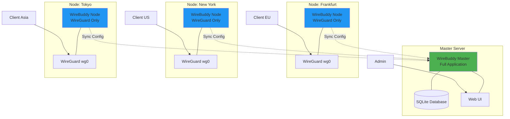

# Multi-Node Deployment

Deploy WireBuddy across multiple geographic locations with the Master-Node architecture.

## Overview

The Master-Node architecture allows you to:

- **Deploy WireGuard servers in multiple countries/regions** while managing them from a single interface
- **Assign peers to specific nodes** based on their geographic location
- **Scale horizontally** by adding more nodes without touching the master
- **Centralize management** — all configuration happens on the master server



## Architecture

### Master Server

The **master** runs the full WireBuddy application including:

- ✅ Web UI and API
- ✅ SQLite database with all configuration
- ✅ User management and authentication
- ✅ Optional: WireGuard interfaces (master can also serve VPN traffic)
- ✅ Optional: DNS resolver (Unbound)
- ✅ Optional: Metrics collection

### Node Server

A **node** runs only what's essential for VPN connectivity:

- ✅ WireGuard kernel module and interfaces
- ✅ Lightweight sync daemon (no web server)
- ✅ Self-signed certificate for mutual TLS authentication
- ❌ No database
- ❌ No web UI
- ❌ No DNS resolver
- ❌ No metrics collection

!!! success "Zero Footprint"
    Nodes have minimal resource requirements — perfect for small VPS instances.

## Security Model

### Enrollment

1. Admin creates a node in the master UI → receives a **signed enrollment token**
2. Token is provided to the node via `WIREBUDDY_ENROLLMENT_TOKEN` environment variable
3. Node generates a self-signed EC P-256 certificate on first boot
4. Node enrolls with master using the token and sends its certificate fingerprint
5. Token is single-use and expires after successful enrollment

Token format:
```
base64url(JSON_PAYLOAD.HMAC_SHA256_SIGNATURE)
```

Signed with `WIREBUDDY_SECRET_KEY` — cannot be forged without access to the master.

### Mutual Authentication

After enrollment, all sync traffic uses **mutual certificate authentication**:

- Node → Master: `Bearer {api_secret}` + `X-Client-Cert-Fingerprint` header
- Master validates both the API secret hash and certificate fingerprint
- No external PKI required — fully self-contained

### Network Security

!!! warning "Firewall Configuration"
    - Master API endpoint (`/api/nodes/*`) should be **firewall-protected**
    - Only allow node IPs to access the sync endpoints
    - Use a VPN tunnel between master and nodes for additional security

## Deployment Guide

### 1. Deploy Master Server

Standard WireBuddy installation with `SERVER_MODE=master` (default):

```yaml
# docker-compose.yml
version: '3.8'
services:
  wirebuddy:
    image: giiibates/wirebuddy:latest
    container_name: wirebuddy-master
    network_mode: host
    cap_add:
      - NET_ADMIN
    environment:
      - WIREBUDDY_SECRET_KEY=${YOUR_SECRET_KEY}
      - SERVER_MODE=master  # or omit (master is default)
      - LOG_LEVEL=INFO
    volumes:
      - ./data:/app/data
    restart: unless-stopped
```

### 2. Create Node in UI

1. Navigate to **Nodes** in the sidebar (admin-only)
2. Click **Add Node**
3. Fill out the form:
   - **Name**: Display name (e.g., "Frankfurt", "NYC-01")
   - **FQDN/IP**: Public address where clients will connect (e.g., `de.vpn.example.com`)
   - **WireGuard Port**: Node's WireGuard listen port (default: `51820`)

4. Click **Create** → enrollment token is displayed

!!! tip "Token Display"
    The token is shown **only once**. Copy it immediately and store securely.

### 3. Deploy Node Server

Create a `docker-compose.yml` on the node machine:

```yaml
# docker-compose.node.yml
version: '3.8'
services:
  wirebuddy-node:
    image: giiibates/wirebuddy:latest
    container_name: wirebuddy-node-frankfurt
    network_mode: host
    cap_add:
      - NET_ADMIN
    environment:
      - SERVER_MODE=node
      - WIREBUDDY_ENROLLMENT_TOKEN=${ENROLLMENT_TOKEN}
      - WIREBUDDY_MASTER_URL=https://master.example.com
      - LOG_LEVEL=INFO
    volumes:
      - ./node-data:/app/data
    restart: unless-stopped
```

**Environment Variables:**

| Variable | Required | Description |
|----------|----------|-------------|
| `SERVER_MODE` | Yes | Must be `node` |
| `WIREBUDDY_ENROLLMENT_TOKEN` | Yes | Token from master UI |
| `WIREBUDDY_MASTER_URL` | Yes | Master API base URL |
| `LOG_LEVEL` | No | Logging verbosity (default: `INFO`) |

Start the node:

```bash
docker-compose -f docker-compose.node.yml up -d
```

### 4. Verify Enrollment

Check node logs:

```bash
docker logs wirebuddy-node-frankfurt
```

Expected output:

```
NODE_DAEMON starting enrollment with master
NODE_DAEMON enrollment successful, node_id=abc123def456
NODE_DAEMON starting sync loop (interval=30s)
NODE_DAEMON heartbeat sent (status=online)
```

In the master UI, the node status should change from `pending` → `online`.

## Usage

### Assigning Peers to Nodes

When creating or editing a peer:

1. In the **Add Peer** or **Edit Peer** modal
2. Select the target node from the **Node** dropdown
3. Leave empty for local peers (master's WireGuard interface)

The peer's configuration will include the node's FQDN and port as the `Endpoint`.

### QR Code Generation

QR codes automatically reflect the node assignment:

- **Local peer**: Master's FQDN + master's public key
- **Remote peer**: Node's FQDN + node interface's public key

#### Node Badge

For peers assigned to a remote node, the QR code image includes a **coloured badge** showing the node name (e.g., "Frankfurt", "NYC-01"). This makes it easy to identify which VPN exit a configuration targets — especially useful when printing QR codes or managing many devices.

!!! info "Local Peers"
    Peers assigned to the master (local) do not show a node badge.

### Node Management

**View Node Status:**

- Navigate to **Nodes** page
- Each node shows:
  - Status badge (online/offline/pending/error)
  - Last seen timestamp
  - WireGuard port
  - Number of assigned peers

**Edit Node:**

- Update name, FQDN, or WireGuard port
- Changes propagate to all peers on that node on next sync

**Regenerate Enrollment Token:**

- If a node needs to re-enroll (e.g., lost certificate)
- Old token is invalidated
- Deploy new token to node

**Delete Node:**

- Removes node from database
- All peers on that node are **unassigned** (node_id set to NULL)
- Node will fail authentication on next sync attempt

!!! danger "Peer Handling"
    Deleting a node does **not** delete its peers. Update peer assignments before deletion.

## Sync Behavior

### Heartbeat

Nodes send a heartbeat every **30 seconds** with:

- Current timestamp
- WireGuard interface status

Master updates `last_seen` timestamp and sets `status=online`.

### Config Pull

Nodes fetch configuration every **30 seconds** and compare `config_version`:

- If version changed → apply config diff
- Only changed interfaces are updated (no service disruption)
- Only changed peers within an interface are updated

### Stale Detection

Master's scheduled task runs every **60 seconds** and marks nodes as `offline` if:

- `last_seen` is older than **90 seconds**

### Error Handling

Nodes use **exponential backoff** on sync failures:

- Initial retry: 5 seconds
- Max backoff: 5 minutes
- Backoff resets on successful sync

## Configuration Details

### WireGuard Interfaces on Nodes

Nodes create WireGuard interfaces based on master configuration:

- Interface name, IP address, listen port from master
- Keypairs are **node-specific** and stored in `node_interfaces` table
- Private keys are Fernet-encrypted in master database

### DNS Resolution & Tunneling

Nodes do **not** run their own DNS resolver. Instead, a **WireGuard tunnel** is automatically created between each node and the master during enrollment:

1. Master allocates a tunnel IP for the node on the first WireGuard interface
2. Node configures the master as a WireGuard peer with `PersistentKeepalive = 25`
3. Node peers receive the **master's DNS server IP** (Unbound) in their client config
4. DNS queries from node peers are routed through the WireGuard tunnel back to the master

This ensures:

- **Centralised ad-blocking** — all peers benefit from the master's blocklists, regardless of which node they connect to
- **Centralised DNS logging** — all queries appear in the master's DNS log
- **No DNS software required on nodes** — keeps node footprint minimal

!!! note "Internet Traffic"
    Only DNS traffic is tunnelled to the master. Regular internet traffic exits directly through the node's outbound connection.

### Metrics & Logs

Nodes **do not collect metrics** or DNS logs. All telemetry happens on the master (for master's local peers only).

Remote peer statistics require out-of-band collection (future feature).

## Troubleshooting

### Node Shows "Offline" in UI

**Check node logs:**

```bash
docker logs wirebuddy-node-frankfurt --tail 50
```

**Common issues:**

- **Network connectivity**: Master URL not reachable from node
- **Firewall**: Master API port blocked
- **Certificate mismatch**: Delete `node-data/cert.pem` and `node-data/key.pem`, restart node

### Node Fails Enrollment

**Error: "Invalid enrollment token"**

- Token was already used
- Token signature is invalid (mismatch in `WIREBUDDY_SECRET_KEY`)
- Regenerate token in master UI

**Error: "Node ID not found"**

- Node was deleted from master after enrollment
- Recreate node and re-deploy with new token

### Peer Config Shows Wrong Endpoint

**Symptoms:**

- Peer QR code or config shows master's FQDN instead of node's

**Solution:**

- Check peer's `node_id` assignment in UI
- Verify node's FQDN is correct in Nodes page
- Re-download peer config after fixing

### Config Changes Not Propagating

**Check:**

1. Node status is `online` (not `offline` or `error`)
2. Node logs show successful config pulls: `NODE_DAEMON config applied`
3. Master's `config_version` incremented after peer changes (check logs)

**Force sync:**

- Restart node: `docker restart wirebuddy-node-frankfurt`
- Node will fetch latest config on startup

## API Reference

### Admin Endpoints (Master)

```http
POST   /api/nodes
GET    /api/nodes
GET    /api/nodes/{node_id}
PATCH  /api/nodes/{node_id}
DELETE /api/nodes/{node_id}
POST   /api/nodes/{node_id}/token
```

### Sync Endpoints (Node → Master)

```http
POST /api/nodes/enroll
POST /api/nodes/{node_id}/heartbeat
GET  /api/nodes/{node_id}/config
```

See [API Reference](../api/endpoints.md) for full documentation.

## Performance Considerations

### Master Server

- No performance impact from nodes (sync traffic is minimal)
- Database grows by ~1 KB per node
- API rate limiting applies to node sync endpoints (configurable)

### Node Server

- **RAM**: ~50 MB base + WireGuard kernel module overhead
- **CPU**: Idle <1%, config sync spikes to ~5% for <1 second
- **Network**: ~200 bytes/30s for heartbeat + config (if unchanged)
- **Disk**: ~10 MB (Python runtime + certificate)

### Scaling Limits

- **Tested**: 1 master + 10 nodes, 1000 total peers
- **Theoretical**: 1 master + 100+ nodes (limited by SQLite write contention)
- **Recommended**: Use read replicas or TSDB for large deployments (>10 nodes)

## Future Enhancements

Features planned for future releases:

- [ ] Node-to-master VPN tunnel with automatic setup
- [ ] Remote peer metrics collection (agent on nodes)
- [ ] Health checks with automatic failover
- [ ] DNS resolver on nodes (optional)
- [ ] Multi-master with Raft consensus
- [ ] Web-based node monitoring dashboard

## FAQ

??? question "Can a node also be a master?"
    No. A server runs either as `master` or `node`, not both. However, a master can have local WireGuard interfaces serving peers directly.

??? question "Can peers connect to multiple nodes?"
    No. Each peer is assigned to exactly one node. For multi-path, configure separate peers.

??? question "What happens if the master goes down?"
    Nodes continue serving VPN traffic with their last known config. Re-sync resumes when master is back online. No auth/config changes are possible while master is down.

??? question "Can I use Let's Encrypt on nodes?"
    Not needed. Nodes use self-signed certificates for master authentication only. Client-facing certificates (if any) should be provisioned separately.

??? question "How do I migrate a peer from one node to another?"
    Edit the peer in the UI and change the **Node** dropdown. The peer's config regenerates with the new endpoint.

??? question "Can I run a node without Docker?"
    Yes. Set `SERVER_MODE=node` and the enrollment variables in `.env`, then run `python run.py`. Requires Python 3.11+ and WireGuard installed.
