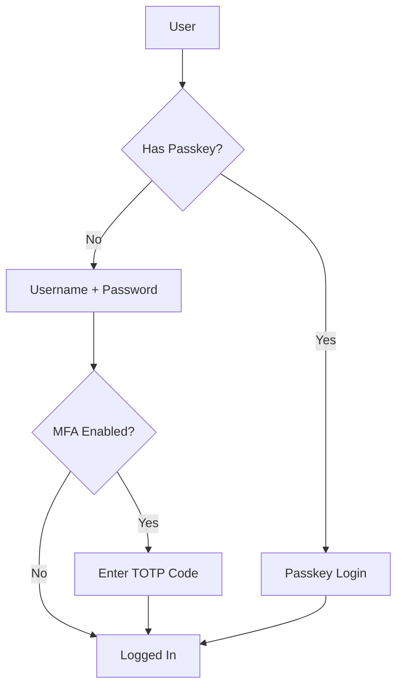

# Authentication

WireBuddy supports multiple authentication methods for flexible and secure access control.

## Authentication Methods

| Method | Security Level | User Experience | Use Case |
|--------|---------------|-----------------|----------|
| **Passkeys** | ⭐⭐⭐⭐⭐ | Excellent | Primary method (recommended) |
| **Password + MFA** | ⭐⭐⭐⭐ | Good | Backup or traditional preference |
| **Password Only** | ⭐⭐ | Excellent | Not recommended (weak) |

## Authentication Flow

### Standard Login



## Password Authentication

### Password Hashing

WireBuddy uses PBKDF2-SHA256:

- **Iterations:** 600,000 (exceeds OWASP recommendation)
- **Salt:** Random 32-byte salt per password
- **Algorithm:** SHA-256
- **Verification:** Constant-time comparison

**Example (Python):**

```python
from cryptography.hazmat.primitives.kdf.pbkdf2 import PBKDF2HMAC
from cryptography.hazmat.primitives import hashes
import os

def hash_password(password: str) -> tuple:
    salt = os.urandom(32)
    kdf = PBKDF2HMAC(
        algorithm=hashes.SHA256(),
        length=32,
        salt=salt,
        iterations=600_000
    )
    key = kdf.derive(password.encode())
    return salt, key

def verify_password(password: str, salt: bytes, stored_key: bytes) -> bool:
    kdf = PBKDF2HMAC(
        algorithm=hashes.SHA256(),
        length=32,
        salt=salt,
        iterations=600_000
    )
    try:
        kdf.verify(password.encode(), stored_key)
        return True
    except:
        return False
```

### Password Requirements

- Minimum 8 characters
- At least one uppercase letter
- At least one lowercase letter
- At least one number
- At least one special character

Enforced via regex:

```python
PASSWORD_REGEX = r'^(?=.*[a-z])(?=.*[A-Z])(?=.*\d)(?=.*[@$!%*?&])[A-Za-z\d@$!%*?&]{8,}$'
```

### Password Reset

1. User clicks "Forgot Password"
2. Enters username/email
3. Reset token emailed (SHA-256, expires in 1 hour)
4. User clicks link, enters new password
5. Token invalidated, sessions revoked

## Multi-Factor Authentication (MFA)

### TOTP (Time-based One-Time Password)

WireBuddy implements RFC 6238 TOTP:

- **Algorithm:** HMAC-SHA1
- **Digits:** 6
- **Period:** 30 seconds
- **Window:** ±1 period (90 seconds total)

**Setup Process:**

1. User enables MFA
2. WireBuddy generates secret:
   ```python
   import pyotp
   
   secret = pyotp.random_base32()
   totp = pyotp.TOTP(secret)
   ```
3. User scans QR code or enters secret manually
4. User verifies with current code
5. Recovery codes generated (10 single-use codes)

**Login with MFA:**

```python
def verify_totp(user_secret: str, user_code: str) -> bool:
    totp = pyotp.TOTP(user_secret)
    return totp.verify(user_code, valid_window=1)
```

### Recovery Codes

10 single-use codes generated on MFA enrollment:

- Format: `ABCD-1234-EFGH`
- SHA-256 hashed before storage
- Used in place of TOTP during login
- Regenerate anytime (invalidates old codes)

## Passkeys (WebAuthn)

See [Passkeys Documentation](passkeys.md) for complete guide.

**Brief overview:**

- Public key cryptography (no shared secrets)
- Browser/OS integrated (Touch ID, Windows Hello, security keys)
- Phishing resistant
- FIDO2 compliant

## Session Management

### Session Tokens

- **Generation:** Cryptographically random (256 bits)
- **Storage:** SHA-256 hash in database
- **Transmission:** Secure, HttpOnly cookie
- **Expiry:** Configurable (default: 30 minutes)
- **Renewal:** Automatic on activity

**Token Generation:**

```python
import secrets
import hashlib

def create_session(user_id: int) -> str:
    # Generate token
    token = secrets.token_urlsafe(32)
    
    # Hash for storage
    token_hash = hashlib.sha256(token.encode()).hexdigest()
    
    # Store in database
    store_session(user_id, token_hash, expires_at)
    
    return token
```

### Session Security

- **HttpOnly:** Prevent JavaScript access
- **Secure:** HTTPS only (when available)
- **SameSite:** Lax (prevent CSRF)
- **Expiry:** Sliding window (renews on activity)
- **Invalidation:** Logout, password change, admin action

### Concurrent Sessions

Users can have multiple active sessions (different devices).

**Settings → Security → Allow Concurrent Sessions**

- **Enabled:** Multiple devices simultaneously
- **Disabled:** One session per user (logout others on new login)

## API Authentication

### Bearer Tokens

Generate API tokens for programmatic access:

**Profile → API Tokens → Create**

**Token Format:**

```
wb_1234567890abcdefghijklmnopqrstuvwxyz
```

**Token Storage:**

- SHA-256 hash in database
- Shown only once after creation
- Cannot be retrieved after initial display

**Usage:**

```bash
curl -H "Authorization: Bearer wb_TOKEN" \
  https://vpn.example.com/api/peers
```

See [API Authentication](../api/authentication.md) for details.

## CSRF Protection

WireBuddy implements double-submit cookie CSRF protection:

### How It Works

1. **Login:** CSRF token generated and stored in session
2. **Cookie:** Token set in secure cookie
3. **Request:** Frontend includes token in header
4. **Validation:** Server compares header token with cookie
5. **Origin Check:** Verify Origin/Referer header

**Implementation:**

```python
def generate_csrf_token() -> str:
    return secrets.token_urlsafe(32)

def validate_csrf(request_token: str, session_token: str) -> bool:
    if not request_token or not session_token:
        return False
    return secrets.compare_digest(request_token, session_token)
```

### Exempt Endpoints

CSRF not required for:

- GET requests (read-only)
- API endpoints with Bearer token
- Webhook endpoints (signed payloads)

## Rate Limiting

Prevent brute-force attacks:

| Endpoint | Limit | Window | Lockout |
|----------|-------|--------|---------|
| **Login** | 5 attempts | 15 min | Progressive (1m, 5m, 15m) |
| **MFA Verify** | 5 attempts | 5 min | 5 minutes |
| **Password Reset** | 3 attempts | 1 hour | 1 hour |
| **API (auth)** | 100 req | 1 min | 1 minute |
| **API (unauth)** | 10 req | 1 min | 1 minute |

See [Rate Limiting](rate-limiting.md) for details.

## IP Tracking

WireBuddy tracks client IP for security:

### Via Reverse Proxy

Automatically extracts real IP from `X-Forwarded-For`:

```python
def get_client_ip(request) -> str:
    # Check for X-Forwarded-For from trusted proxy
    forwarded_for = request.headers.get('X-Forwarded-For')
    if forwarded_for and is_trusted_proxy(request.client.host):
        return forwarded_for.split(',')[0].strip()
    
    # Fallback to direct connection
    return request.client.host
```

**Trusted proxies:**

- Private IP ranges (auto-detected)
- Custom list (configurable)

### Use Cases

- Rate limiting (per IP)
- Brute-force detection
- Login history
- Audit logging

## Security Headers

WireBuddy sets security headers automatically:

```http
Strict-Transport-Security: max-age=31536000; includeSubDomains
X-Content-Type-Options: nosniff
X-Frame-Options: DENY
X-XSS-Protection: 1; mode=block
Referrer-Policy: strict-origin-when-cross-origin
Permissions-Policy: geolocation=(), microphone=(), camera=()
Content-Security-Policy: default-src 'self'; ...
```

## Audit Logging

All authentication events are logged:

```json
{
  "timestamp": "2026-03-15T14:30:00Z",
  "event": "login_success",
  "user": "admin",
  "ip": "203.0.113.42",
  "method": "password_mfa",
  "user_agent": "Mozilla/5.0 ...",
  "session_id": "abc123...",
  "metadata": {
    "mfa_method": "totp"
  }
}
```

**Logged Events:**

- Login success/failure
- Logout
- Password change
- MFA enrollment/use
- Passkey registration/use
- API token creation/revocation
- Session revocation

**Access logs:**

**Profile → Security → Login History**

Or via API:

```bash
curl -H "Authorization: Bearer TOKEN" \
  https://vpn.example.com/api/users/me/login-history
```

## Best Practices

### For Users

1. **Use passkeys** when possible (most secure)
2. **Enable MFA** if using password
3. **Use strong passwords** (12+ characters, unique)
4. **Review active sessions** regularly
5. **Revoke unused API tokens**
6. **Monitor login history** for suspicious activity

### For Admins

1. **Enforce MFA** for admin accounts
2. **Set reasonable session timeout** (30 minutes)
3. **Enable rate limiting** (always on)
4. **Review audit logs** weekly
5. **Disable Swagger UI** in production (if not needed)
6. **Use HTTPS** always (enable Force HTTPS)
7. **Configure trusted proxies** correctly

## Troubleshooting

See [Troubleshooting Guide](../troubleshooting.md#authentication-issues) for common authentication problems.

## Next Steps

- [Passkeys (WebAuthn)](passkeys.md) - Passwordless authentication
- [Rate Limiting](rate-limiting.md) - Brute-force protection
- [Security Overview](overview.md) - Complete security documentation
- [User Management](../features/users.md) - Managing users
