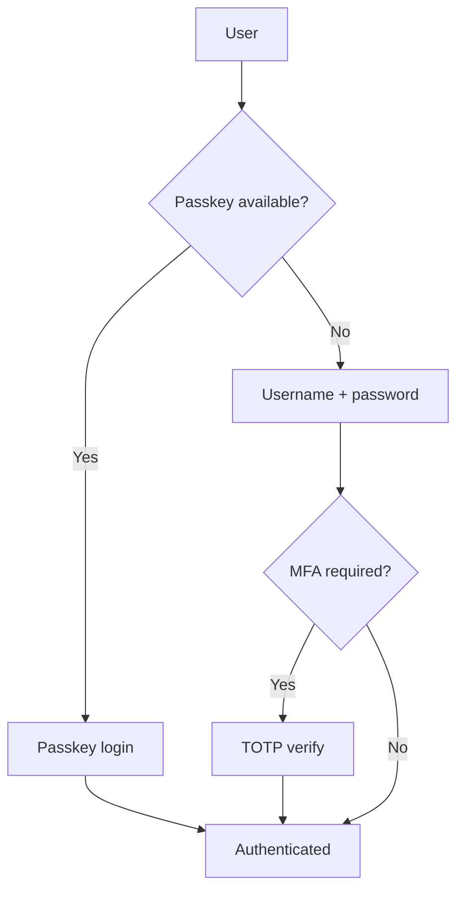

# Authentication

WireBuddy supports multiple authentication paths with shared session handling.

## Authentication Methods

| Method | Security Level | Typical Use |
|---|---|---|
| Passkeys (WebAuthn) | Very high | Recommended primary method |
| Password + MFA (TOTP) | High | Strong fallback/traditional flow |
| Password only | Lower | Legacy/minimal setups |

## Core Login Flow



## Password Security

- PBKDF2-SHA256
- 600,000 iterations
- Random per-password salt
- Constant-time verification

## MFA

TOTP parameters:

- 6 digits
- 30-second period
- Verification window: plus/minus one step

Recovery codes are generated for MFA recovery and stored hashed.

## Passkeys

WireBuddy supports WebAuthn passkeys for passwordless authentication.

- Platform authenticators (for example Touch ID, Windows Hello)
- Security keys
- Phishing-resistant public-key cryptography

See [Passkeys](passkeys.md).

## Session Model

- Session token stored server-side as hash
- Client auth via auth_token cookie or Bearer header
- Sliding expiry refresh on active cookie-authenticated usage
- Immediate invalidation on logout

## API Authentication Notes

Programmatic API clients use:

```text
Authorization: Bearer <auth_token>
```

This is the same session-token model as browser auth, not a separate API-token
product.

Node sync endpoints use dedicated node auth (node secret + certificate
fingerprint) and are separate from user session auth.

## CSRF Protection

State-changing browser requests use CSRF defenses (double-submit pattern plus
origin checks). Read-only requests are unaffected.

## Rate Limiting

Authentication-related routes are rate-limited with progressive lockout for
failed attempts. See [Rate Limiting](rate-limiting.md).

## Audit and Monitoring

Authentication-relevant events are logged, including:

- Login success/failure
- MFA verification events
- Passkey registration/authentication events
- Session invalidation actions

## Best Practices

### Users

1. Prefer passkeys where possible.
2. Enable MFA when using passwords.
3. Use unique strong passwords.
4. Keep a fallback method for account recovery.

### Admins

1. Enforce least privilege for admin users.
2. Review auth-related logs regularly.
3. Use HTTPS everywhere.
4. Configure trusted proxy setup correctly.

## Next Steps

- [Passkeys](passkeys.md)
- [Rate Limiting](rate-limiting.md)
- [Security Overview](overview.md)
