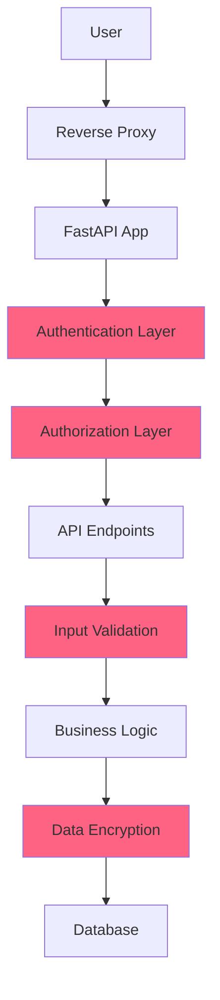

# Security Overview

WireBuddy implements defense-in-depth security with multiple layers of protection.

## Security Architecture



## Authentication

### Password Security

WireBuddy uses industry-standard password hashing:

| Component | Implementation |
|-----------|----------------|
| **Algorithm** | PBKDF2-SHA256 |
| **Iterations** | 600,000 (exceeds OWASP recommendation of 310,000) |
| **Salt** | Random 32-byte salt per password |
| **Verification** | Constant-time comparison to prevent timing attacks |

**Password Requirements:**

- Minimum 8 characters
- At least one uppercase letter
- At least one lowercase letter
- At least one number
- At least one special character

??? example "Password Hashing Code"
    ```python
    from cryptography.hazmat.primitives.kdf.pbkdf2 import PBKDF2
    
    def hash_password(password: str) -> str:
        salt = os.urandom(32)
        kdf = PBKDF2(
            algorithm=hashes.SHA256(),
            length=32,
            salt=salt,
            iterations=600_000
        )
        key = kdf.derive(password.encode())
        return f"{salt.hex()}${key.hex()}"
    ```

### Multi-Factor Authentication (MFA)

WireBuddy supports **TOTP (Time-based One-Time Password)** compatible with:

- Google Authenticator
- Authy
- Microsoft Authenticator
- 1Password
- Bitwarden

**TOTP Configuration:**

- Algorithm: SHA-1
- Digits: 6
- Period: 30 seconds
- Window: ±1 period (90 seconds)

### Passkeys (WebAuthn)

WireBuddy implements **WebAuthn** for passwordless authentication:

- **FIDO2** compliant
- Supports platform authenticators (Touch ID, Windows Hello)
- Supports security keys (YubiKey, etc.)
- Public key cryptography (no shared secrets)
- Phishing-resistant

See [Passkeys Documentation](passkeys.md) for details.

## Authorization

### Role-Based Access Control (RBAC)

WireBuddy has two roles:

| Role | Permissions |
|------|-------------|
| **Admin** | Full access: create/edit/delete interfaces, peers, users, settings |
| **User** | Read-only: view dashboard, peers, DNS logs (cannot modify) |

### Session Management

- **Session Token:** Cryptographically random (256 bits)
- **Storage:** Hashed with SHA-256 before database storage
- **Expiry:** Configurable (default: 30 minutes)
- **Renewal:** Automatic on activity
- **Revocation:** Logout invalidates immediately

### CSRF Protection

WireBuddy implements double-submit cookie pattern:

1. CSRF token generated on login
2. Token stored in secure, HttpOnly cookie
3. Token must be included in request headers for state-changing operations
4. Origin header validation as additional defense

## Data Protection

### Secrets at Rest

Sensitive data is encrypted before database storage:

| Data Type | Encryption |
|-----------|------------|
| **WireGuard Private Keys** | Fernet (AES-128-CBC + HMAC-SHA256) |
| **TOTP Secrets** | Fernet |
| **ACME Account Keys** | Fernet |
| **Session/Auth Tokens** | SHA-256 hash (not encrypted, one-way) |

**Encryption Details:**

- **Key Derivation:** PBKDF2 with `WIREBUDDY_SECRET_KEY` + per-row salt
- **Algorithm:** Fernet (symmetric encryption)
- **Per-Row Salt:** Unique 32-byte salt for each record
- **Application Pepper:** Global secret from environment variable

??? example "Encryption Code"
    ```python
    from cryptography.fernet import Fernet
    from cryptography.hazmat.primitives.kdf.pbkdf2 import PBKDF2
    
    def encrypt(plaintext: str, salt: bytes) -> str:
        kdf = PBKDF2(
            algorithm=hashes.SHA256(),
            length=32,
            salt=salt,
            iterations=100_000
        )
        key = base64.urlsafe_b64encode(kdf.derive(SECRET_KEY.encode()))
        f = Fernet(key)
        return f.encrypt(plaintext.encode()).decode()
    ```

### Database Security

- **Type:** SQLite3 with WAL mode
- **Location:** Inside Docker volume (not directly accessible)
- **Permissions:** Container UID only (no host access)
- **Backups:** Encrypted at rest (user responsibility)

## Network Security

### Reverse Proxy Trust

WireBuddy automatically trusts `X-Forwarded-For` headers from:

- `127.0.0.0/8` (localhost)
- `10.0.0.0/8` (private)
- `172.16.0.0/12` (private)
- `192.168.0.0/16` (private)
- `::1` (IPv6 localhost)
- `fc00::/7` (IPv6 private)

This enables proper rate limiting and IP tracking behind reverse proxies without manual configuration.

### Rate Limiting

WireBuddy implements progressive rate limiting:

| Endpoint | Limit | Window |
|----------|-------|--------|
| **Login** | 5 attempts | 15 minutes |
| **API (authenticated)** | 100 requests | 1 minute |
| **API (unauthenticated)** | 10 requests | 1 minute |
| **MFA Verify** | 5 attempts | 5 minutes |

**Lockout Behavior:**

- First violation: 1-minute lockout
- Second violation: 5-minute lockout
- Third+ violation: 15-minute lockout
- Exponential backoff for repeated violations

See [Rate Limiting Documentation](rate-limiting.md) for details.

### HTTPS/TLS

WireBuddy supports TLS termination at:

1. **Reverse Proxy** (recommended): Caddy, nginx, Traefik
2. **Built-in ACME Client**: Let's Encrypt integration
3. **Manual Certificate**: Provide cert/key pair

**Security Headers:**

WireBuddy sets security headers automatically:

```http
Strict-Transport-Security: max-age=31536000; includeSubDomains
X-Content-Type-Options: nosniff
X-Frame-Options: DENY
X-XSS-Protection: 1; mode=block
Referrer-Policy: strict-origin-when-cross-origin
Permissions-Policy: geolocation=(), microphone=(), camera=()
```

## Input Validation

### Pydantic Models

All API inputs are validated using Pydantic:

- Type checking
- Format validation
- Range constraints
- Custom validators

### Regex Patterns

Critical inputs use strict regex validation:

| Input | Pattern | Purpose |
|-------|---------|---------|
| **Interface Name** | `^[a-zA-Z0-9_-]+$` | Prevent command injection |
| **IP Address** | IPv4/IPv6 validation | Ensure valid CIDR |
| **Domain Name** | RFC compliant | Prevent DNS injection |

### Sanitization

User-provided text is sanitized:

- **HTML:** Stripped or escaped (no raw HTML rendering)
- **Shell Commands:** Never directly executed with user input
- **SQL:** Parameterized queries only (no string concatenation)

## Container Security

### Minimal Capabilities

WireBuddy container runs with:

```yaml
cap_drop:
  - ALL
cap_add:
  - NET_ADMIN  # Required for WireGuard
security_opt:
  - no-new-privileges:true
```

### Read-Only Filesystem

Optional read-only root filesystem:

```yaml
read_only: true
tmpfs:
  - /tmp
  - /run
```

### User Namespacing

Container runs as non-root user inside container (UID 1000).

## Audit Logging

WireBuddy logs security-sensitive events:

- User login/logout (success and failure)
- Password changes
- MFA enrollment/use
- Passkey registration/authentication
- Peer creation/deletion
- Interface start/stop
- Settings changes
- Failed authentication attempts

Logs include:

- Timestamp
- User
- IP address
- Action
- Result (success/failure)

## Vulnerability Disclosure

### Reporting Security Issues

**Do not open public GitHub issues for security vulnerabilities.**

Instead:

1. Email: [security contact - update as needed]
2. Include:
   - Vulnerability description
   - Steps to reproduce
   - Impact assessment
   - Suggested fix (if any)

### Response Timeline

- **Acknowledgment:** Within 48 hours
- **Initial Assessment:** Within 7 days
- **Fix:** Based on severity (critical: ASAP, high: 30 days, medium: 90 days)
- **Public Disclosure:** After fix is released

## Security Updates

- **Critical vulnerabilities:** Immediate patch release
- **Security patches:** Released out-of-band as needed
- **Dependency updates:** Monthly review and update

Subscribe to [GitHub Releases](https://github.com/Gill-Bates/wirebuddy/releases) for notifications.

## Compliance

WireBuddy implements controls relevant to:

- **OWASP Top 10** (2021)
- **CWE Top 25** (2023)
- **NIST Cybersecurity Framework**

## Security Best Practices

For deployment best practices, see [Best Practices Guide](best-practices.md).

## Security Testing

WireBuddy undergoes:

- **Static analysis:** Bandit, Semgrep
- **Dependency scanning:** Safety, Dependabot
- **Container scanning:** Trivy
- **Penetration testing:** Periodic (community contributions welcome)

## Third-Party Security Tools

Recommended tools for hardening:

- **Fail2ban:** Automated IP banning
- **ModSecurity:** Web application firewall
- **CrowdSec:** Collaborative security
- **Wazuh:** Host-based intrusion detection

## Next Steps

- [Authentication Guide](authentication.md)
- [Passkeys (WebAuthn)](passkeys.md)
- [Rate Limiting](rate-limiting.md)
- [Best Practices](best-practices.md)
