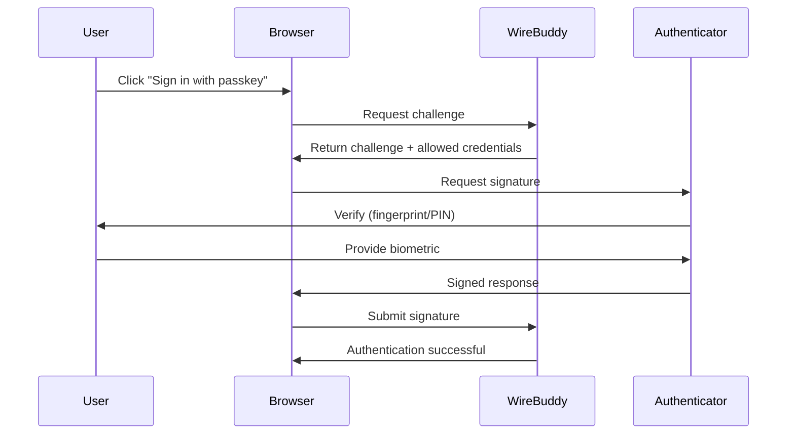

# Passkeys (WebAuthn)

WireBuddy supports passwordless authentication using Passkeys (WebAuthn/FIDO2).

## Overview

Passkeys provide:

- 🔐 **Passwordless Login:** No password required
- 🛡️ **Phishing Resistant:** Cannot be stolen or phished
- 🚀 **Fast Authentication:** Touch ID, Face ID, or security key
- 🔑 **Public Key Cryptography:** No shared secrets

## How Passkeys Work



## Supported Authenticators

### Platform Authenticators

Built into your device:

- **macOS/iOS:** Touch ID, Face ID
- **Windows:** Windows Hello (fingerprint, face, PIN)
- **Android:** Fingerprint, face unlock, screen lock

### Security Keys (Cross-Platform)

External hardware keys:

- **YubiKey** (5 series)
- **Google Titan Security Key**
- **Feitian keys**
- Any FIDO2-certified key

## Browser Support

| Browser | Version | Support |
|---------|---------|---------|
| Chrome | 109+ | ✅ Full |
| Edge | 109+ | ✅ Full |
| Safari | 16+ | ✅ Full |
| Firefox | 119+ | ✅ Full |
| Brave | 1.51+ | ✅ Full |

## Setting Up Passkeys

### For Users

1. **Login with password** (and MFA if enabled)
2. Navigate to **Profile → Security → Passkeys**
3. Click **Add Passkey**
4. **Choose authenticator:**
   - This device (platform authenticator)
   - Security key (USB/NFC)
5. **Follow prompts:**
   - Touch ID: Place finger on sensor
   - Face ID: Look at camera
   - Windows Hello: Use configured method
   - Security key: Insert key and touch button
6. **Name your passkey** (e.g., "MacBook Pro Touch ID")
7. Click **Save**

### For Admins

Enable passkeys globally:

**Settings → Security → Passkeys → Enable**

Options:

- **Allow Platform Authenticators:** Touch ID, Windows Hello
- **Allow Cross-Platform:** Security keys
- **Require User Verification:** Enforce biometric/PIN (recommended)

## Using Passkeys

### Login with Passkey

1. Navigate to login page
2. Enter username (or click "Sign in with passkey")
3. Browser prompts for passkey
4. Authenticate (fingerprint, face, security key)
5. Logged in immediately

### Fallback to Password

Passkeys are **optional**. You can always use password + MFA.

## Managing Passkeys

### View Registered Passkeys

**Profile → Security → Passkeys**

| Name | Type | Created | Last Used | Actions |
|------|------|---------|-----------|---------|
| MacBook Pro Touch ID | Platform | 2026-01-15 | 2 hours ago | [Rename] [Delete] |
| YubiKey 5C | Security Key | 2026-02-01 | 3 days ago | [Rename] [Delete] |

### Rename Passkey

Give passkeys descriptive names:

- ✅ "Work Laptop Touch ID"
- ✅ "Phone Fingerprint"
- ✅ "YubiKey Backup"
- ❌ "Authenticator 1"

### Delete Passkey

Remove passkey immediately:

1. Click **Delete**
2. Confirm removal
3. Passkey is revoked

!!! warning
    Ensure you have another authentication method before deleting all passkeys.

## Security Considerations

### Attestation

WireBuddy supports attestation for key verification:

**Settings → Security → Passkeys → Attestation**

Options:

- **None:** No attestation (default, most compatible)
- **Indirect:** Anonymous attestation
- **Direct:** Full attestation (verify authenticator model)

**Direct attestation** allows you to:

- Verify specific security key models
- Enforce corporate key policies
- Detect cloned keys

### User Verification

**Require User Verification:**

- ✅ **Enabled:** Force PIN/biometric (recommended)
- ❌ **Disabled:** Possession-only (less secure)

User verification ensures:

- User is physically present
- Biometric or PIN verified
- Prevents unauthorized use if device unlocked

### Backup Passkeys

Register multiple passkeys:

1. **Primary:** Daily use device (laptop, phone)
2. **Backup:** Security key stored securely
3. **Alternative:** Different device

This ensures you can always access your account.

### Recovery

If all passkeys are lost:

1. **Recovery codes:** Use MFA recovery codes
2. **Admin reset:** Contact admin to disable passkeys
3. **Password:** Use password + MFA

## Advanced Configuration

### Relying Party Settings

**Settings → Security → Passkeys → Advanced**

```json
{
  "rpName": "WireBuddy",
  "rpID": "vpn.example.com",
  "origins": [
    "https://vpn.example.com"
  ],
  "timeout": 60000,
  "userVerification": "required",
  "attestation": "none"
}
```

### Allowed Authenticators

Restrict to specific authenticator types:

```json
{
  "authenticatorSelection": {
    "authenticatorAttachment": "cross-platform",
    "requireResidentKey": false,
    "residentKey": "preferred",
    "userVerification": "required"
  }
}
```

## Troubleshooting

### Passkey Registration Fails

**Problem:** "Registration failed" error

**Causes:**

1. **Browser not supported:** Update browser
2. **HTTPS required:** Passkeys only work over HTTPS
3. **Domain mismatch:** RP ID doesn't match domain
4. **Authenticator unavailable:** Touch ID disabled, security key not inserted

**Solutions:**

- Use supported browser (Chrome 109+, Safari 16+, Firefox 119+)
- Access via HTTPS (not HTTP)
- Check authenticator is available and functional

### Passkey Login Fails

**Problem:** "Authentication failed"

**Causes:**

1. **Wrong authenticator:** Using different device/key than registered
2. **Passkey revoked:** Admin deleted passkey
3. **Timeout:** Didn't respond in time (default: 60 seconds)
4. **User verification failed:** Wrong fingerprint/PIN

**Solutions:**

- Use the same authenticator you registered
- Check passkey still exists in profile
- Respond to prompt within 60 seconds
- Retry biometric or enter correct PIN

### Touch ID Not Working (macOS)

**Problem:** Touch ID prompt doesn't appear

**Solutions:**

1. Check Touch ID is enabled:
   ```
   System Settings → Touch ID & Password
   ```

2. Restart browser

3. Reset Touch ID (as last resort):
   ```
   System Settings → Touch ID & Password → Remove all fingerprints → Re-add
   ```

### Security Key Not Detected

**Problem:** Browser doesn't detect security key

**Solutions:**

1. **Insert key properly:** USB-A vs USB-C adapter
2. **Touch key button:** Some keys require touch during detection
3. **Try different USB port**
4. **Check key compatibility:** FIDO2/WebAuthn certified key required
5. **Update key firmware** (if available)

## Best Practices

### For Users

- Register multiple passkeys (primary + backup)
- Use descriptive names for easy identification
- Store backup security key securely (not with primary device)
- Test backup passkey periodically
- Review registered passkeys regularly

### For Admins

- Enable passkeys for all users (optional but recommended)
- Require user verification (biometric/PIN)
- Use platform authenticators for convenience, security keys for high security
- Document recovery procedures
- Monitor passkey usage in audit logs

## Migration Guide

### From Password-Only

1. Users login with password
2. Prompt to register passkey (banner or modal)
3. User registers passkey
4. Continue using password + passkey
5. Optionally disable password once passkey is tested

### From Password + MFA

1. Users login with password + TOTP
2. Register passkey as additional method
3. Use passkey for faster login
4. Keep MFA as backup

### Enforcing Passkeys

**Settings → Security → Enforce Passkeys**

Options:

- **Optional:** Users can choose (default)
- **Recommended:** Encourage but don't require
- **Required:** Block password-only login for new accounts
- **Mandatory:** All users must register passkey (grace period: 30 days)

## Comparison: Passkeys vs Other Methods

| Feature | Passkeys | Password + MFA | Password Only |
|---------|----------|----------------|---------------|
| **Security** | ⭐⭐⭐⭐⭐ | ⭐⭐⭐⭐ | ⭐⭐ |
| **Convenience** | ⭐⭐⭐⭐⭐ | ⭐⭐⭐ | ⭐⭐⭐⭐ |
| **Phishing Resistant** | ✅ Yes | ⚠️ MFA can be phished | ❌ No |
| **Password Reset** | N/A | Needed | Needed |
| **Offline** | ✅ Works | ✅ Works (TOTP) | ✅ Works |
| **Device Required** | ✅ Yes | ⚠️ Phone (TOTP) | ❌ No |

## Resources

- [WebAuthn Guide (WebAuthn.io)](https://webauthn.io/)
- [FIDO Alliance](https://fidoalliance.org/)
- [Passkeys.dev](https://passkeys.dev/)

## Next Steps

- [Authentication Guide](authentication.md) - Overview of auth methods
- [Security Overview](overview.md) - Complete security documentation
- [User Management](../features/users.md) - Managing users
