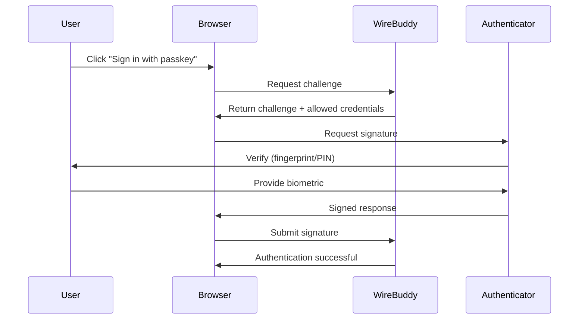

# Passkeys (WebAuthn)

WireBuddy supports passwordless authentication using Passkeys (WebAuthn/FIDO2).

## Overview

Passkeys provide:

- 🔐 **Passwordless Login:** No password required
- 🛡️ **Phishing Resistant:** Cannot be stolen or phished
- 🚀 **Fast Authentication:** Touch ID, Face ID, or security key
- 🔑 **Public Key Cryptography:** No shared secrets

## How Passkeys Work



## Supported Authenticators

### Platform Authenticators

Built into your device:

- **macOS/iOS:** Touch ID, Face ID
- **Windows:** Windows Hello (fingerprint, face, PIN)
- **Android:** Fingerprint, face unlock, screen lock

### Security Keys (Cross-Platform)

External hardware keys:

- **YubiKey** (5 series)
- **Google Titan Security Key**
- **Feitian keys**
- Any FIDO2-certified key

## Browser Support

| Browser | Version | Support |
|---------|---------|---------|
| Chrome | 109+ | ✅ Full |
| Edge | 109+ | ✅ Full |
| Safari | 16+ | ✅ Full |
| Firefox | 119+ | ✅ Full |
| Brave | 1.51+ | ✅ Full |

## Setup and Usage

### For Users

1. Sign in with your existing method (password and optional MFA).
2. Open **Users** and click **Passkey Settings** for your own account.
3. Click **Add Passkey**.
4. Complete the browser authenticator prompt (Touch ID, Face ID, Windows Hello, or a security key).
5. Optional: enter a device name before registration.

### Admin-driven Onboarding

Admins can enable passkey onboarding per user from the user management UI.
The user is then prompted on next login to register a passkey.

### Login with Passkey

1. Open the login page.
2. Click **Sign in with Passkey** (username is optional for discoverable credentials).
3. Complete authenticator verification.

### Fallback Behavior

Passkeys are optional in the current implementation. Password login remains available unless your deployment enforces additional policies outside of the passkey module.

## Managing Passkeys

### Available Actions

- List registered passkeys for the current user.
- Register additional passkeys (up to the configured per-user limit).
- Delete individual passkeys.
- Admin reset of all passkeys for a user.

### Not Currently Available

- Passkey rename endpoint.
- Global passkey policy UI (attestation/user-verification toggles in settings).
- "Enforce passkeys" switch in the web settings UI.

## Configuration

Passkey RP behavior is controlled by environment variables:

- `PASSKEY_RP_ID`: Optional RP ID override. If unset, WireBuddy derives it from the request host.
- `PASSKEY_RP_NAME`: Optional RP display name (default: `WireBuddy`).
- `MAX_PASSKEYS_PER_USER`: Maximum passkeys per account (default: `20`).

Origin is validated from the incoming request scheme and host.

## API Endpoints (Current)

- `POST /api/passkeys/register/start`
- `POST /api/passkeys/register/finish`
- `POST /api/passkeys/login/start`
- `POST /api/passkeys/login/finish`
- `GET /api/passkeys`
- `DELETE /api/passkeys/{passkey_id}`
- `GET /api/passkeys/check`
- `GET /api/passkeys/available`
- `POST /api/passkeys/reset/{user_id}` (admin)
- `GET /api/passkeys/user/{user_id}` (admin)
- `POST /api/passkeys/enable/{user_id}` (admin)
- `POST /api/passkeys/disable/{user_id}` (admin)

## Troubleshooting

### Passkey Registration Fails

**Problem:** "Registration failed" error

**Causes:**

1. **Browser not supported:** Update browser
2. **HTTPS required:** Passkeys only work over HTTPS
3. **Domain mismatch:** RP ID doesn't match domain
4. **Authenticator unavailable:** Touch ID disabled, security key not inserted

**Solutions:**

- Use supported browser (Chrome 109+, Safari 16+, Firefox 119+)
- Access via HTTPS (not HTTP)
- Check authenticator is available and functional

### Passkey Login Fails

**Problem:** "Authentication failed"

**Causes:**

1. **Wrong authenticator:** Using different device/key than registered
2. **Passkey revoked:** Admin deleted passkey
3. **Timeout:** Didn't respond in time (default: 60 seconds)
4. **User verification failed:** Wrong fingerprint/PIN

**Solutions:**

- Use the same authenticator you registered
- Check passkey still exists in profile
- Respond to prompt within 60 seconds
- Retry biometric or enter correct PIN

### Touch ID Not Working (macOS)

**Problem:** Touch ID prompt doesn't appear

**Solutions:**

1. Check Touch ID is enabled:
   ```
   System Settings → Touch ID & Password
   ```

2. Restart browser

3. Reset Touch ID (as last resort):
   ```
   System Settings → Touch ID & Password → Remove all fingerprints → Re-add
   ```

### Security Key Not Detected

**Problem:** Browser doesn't detect security key

**Solutions:**

1. **Insert key properly:** USB-A vs USB-C adapter
2. **Touch key button:** Some keys require touch during detection
3. **Try different USB port**
4. **Check key compatibility:** FIDO2/WebAuthn certified key required
5. **Update key firmware** (if available)

## Best Practices

### For Users

- Register at least two passkeys (daily device + backup key/device).
- Use clear device names at registration time.
- Keep a non-passkey fallback method available.

### For Admins

- Enable onboarding per user and verify setup completion.
- Keep a recovery procedure for lost authenticators.
- Use reset/disable endpoints only when user recovery is needed.

## Comparison: Passkeys vs Other Methods

| Feature | Passkeys | Password + MFA | Password Only |
|---------|----------|----------------|---------------|
| **Security** | ⭐⭐⭐⭐⭐ | ⭐⭐⭐⭐ | ⭐⭐ |
| **Convenience** | ⭐⭐⭐⭐⭐ | ⭐⭐⭐ | ⭐⭐⭐⭐ |
| **Phishing Resistant** | ✅ Yes | ⚠️ MFA can be phished | ❌ No |
| **Password Reset** | N/A | Needed | Needed |
| **Offline** | ✅ Works | ✅ Works (TOTP) | ✅ Works |
| **Device Required** | ✅ Yes | ⚠️ Phone (TOTP) | ❌ No |

## Resources

- [WebAuthn Guide (WebAuthn.io)](https://webauthn.io/)
- [FIDO Alliance](https://fidoalliance.org/)
- [Passkeys.dev](https://passkeys.dev/)

## Next Steps

- [Authentication Guide](authentication.md) - Overview of auth methods
- [Security Overview](overview.md) - Complete security documentation
- [User Management](../features/users.md) - Managing users
